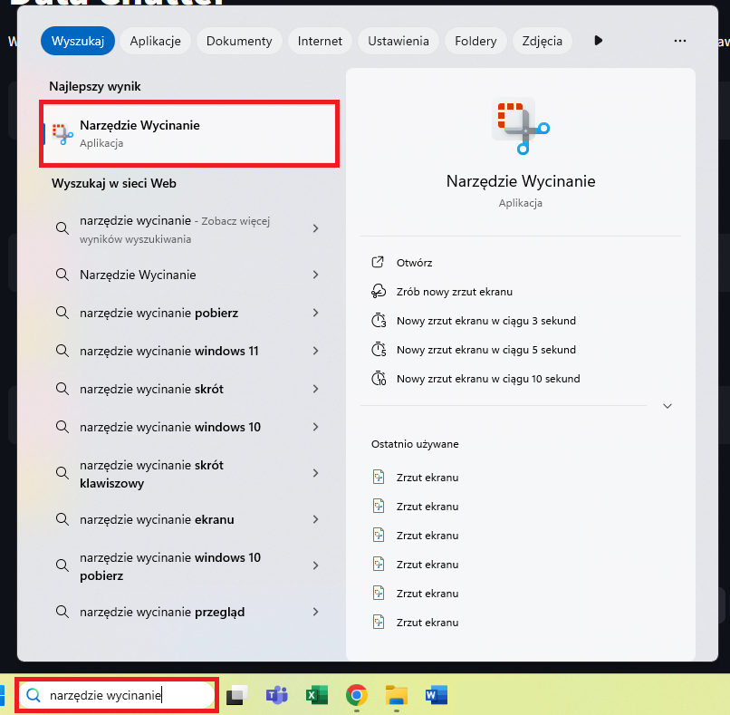
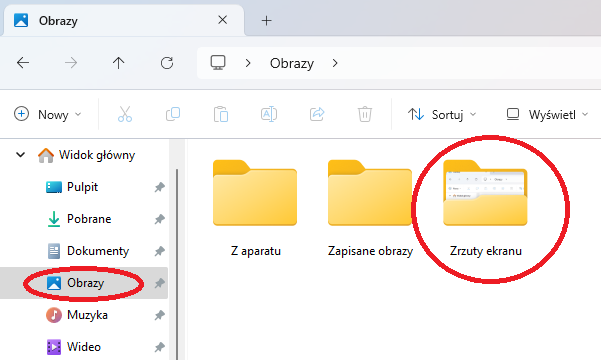
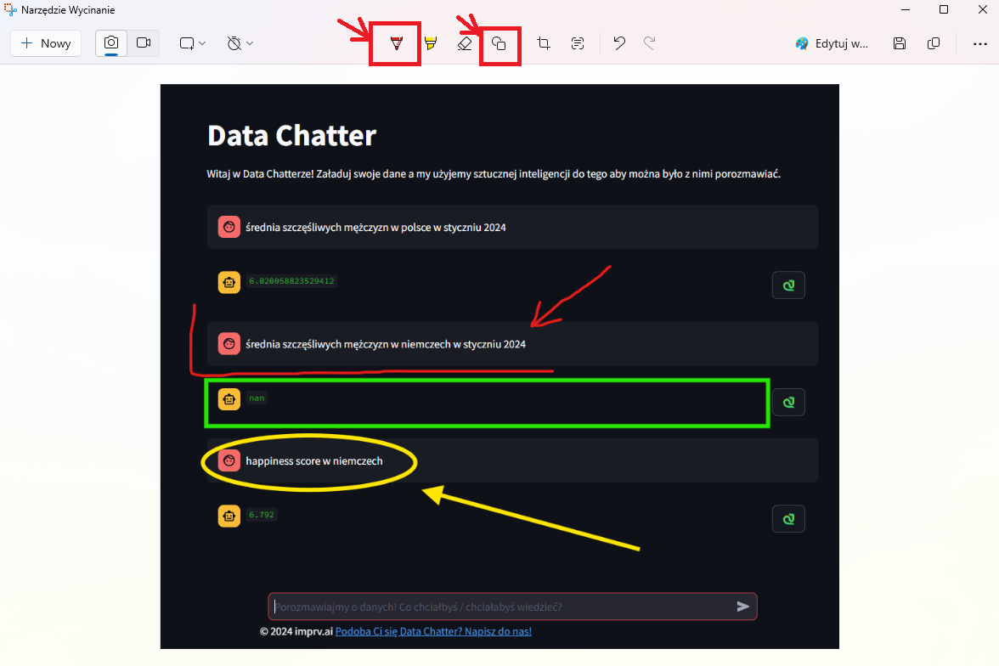

---
tags:
    - discord
    - screen
    - zip
    - prywatna wiadomość
    - narzędzie wycinanie
    - zgłoszenie problemu
    - kanał discord
    - poradnik
    - pomoc
    - FAQ
---

## **Tip 1. Jak zrobić screena?**

Screen - elektroniczny zapis, zrzut obrazu aktualnie wyświetlanego na ekranie komputera. To tak jakby zrobić zdjęcie tego co widzimy na naszym komputerze/monitorze. Screen można zapisać jako plik, można go do kogoś przesłać, coś na nim zaznaczyć, narysować.
Robienie screenów będzie przydatne w kursie, aby pokazywać zadania domowe albo formułować pytania, zgłaszać problemy.

1. Jak zrobić screena - narzędzie wycinanie.

    W miejsce wyszukiwania na pasku zadań wpisz **Narzędzie Wycinanie**, kliknij w nie

    

    Uruchamia się **Narzędzie Wycinanie**

    

    Możesz kliknąć w przycisk **Nowy** albo użyć skrótu klawiszowego **Logo Windows + Shift + S**, następnie zaznacz myszką obszar, który chcesz wyciąć.

    To widok pulpitu i zaznaczenie obszaru:

    

    A tak widać, uzyskanego przez zaznaczenie, screena w **Narzędziu Wycinania**

    

    Sprawdź ustawienia Twojego Narzędzia Wycinania, aby wiedzieć gdzie będą zapisywały się Twoje screeny.

    

    Przy takim ustawieniu, screeny będą trafiały do **Obrazy** > **Zrzuty ekranu**

    

    W Narzędziu Wycinanie możesz edytować Twojego screena, rysować po nim, zaznaczać, podkreślać, robić strzałki.

    

    Możesz wybrać kolor zaznaczania i rozmiar lini.

    

## **Tip 2. Jak i gdzie zgłaszać problem?**

Jeśli w trakcie przechodzenia kursu, wystąpi u Ciebie problem i nie znajdziesz rozwiązania w dziale FAQ, napisz do nas na Discordzie.

Link do naszego kanału znajduje się na stronie głównej kursu **Agenci AI:**

[Link do strony](https://edu.gotoit.pl/index.php/tworz-i-sprzedawaj-agentow-ai-od-zera/)

Aby zgłosić problem na Discordzie, który jest miejscem wymiany doświadczeń i pomocy między kursantami i mentorami, postępuj zgodnie z poniższymi krokami:

1. Wybierz odpowiedni kanał, zgodny z modułem, w którym masz problem np. modul-1-pytania-i-problemy jeśli Twój problem dotyczy lekcji z modułu pierwszego

    Tak wygląda lista kanałów:

    

2. W wiadomości załącz link do lekcji, w której wystąpił Twój problem
3. Opisz jak najwięcej informacji o Twoim problemie
4. Zamieść jeden lub więcej screenów, żeby pokazać szczegóły Twojego problemu.

## **Tip 3. Jak spakować pliki do ZIP-a?**

W przypadku, gdy będziesz miał/miała wiele plików w folderze z zadaniem domowym, aby je wysłać, można skompresować ten cały folder do formatu ZIP. Spakowanie plików pozwala na wysłanie kilku plików jako jednego pliku, a kompresja pozwala, zmniejszyć rozmiar przesyłanych danych, co ułatwia ich wysyłanie. Sam proces jest szybki i prosty.

Wystarczy, że: **Klikniesz prawym przyciskiem myszy na folder,** który chcesz kompresować **>** najedź na: **Kompresuj do >** wybierz **Plik ZIP**

Pod folderem, który wybrałeś/wybrałaś, pojawi się skompresowany folder w formacie ZIP. Jeśli jest taka potrzeba możesz jeszcze zmienić jego nazwę.

**I gotowe!** Tak przygotowany folder np. z zadaniem domowym, możesz wysyłać na Discordzie.

## **Tip 4. Jak wysłać prywatną wiadomość na Discordzie?**

Na Discordzie istnieje możliwość wysłania wiadomości prywatnej, bezpośrednio do jednej, wybranej osoby. W oknie Discorda po prawej stronie, znajduje się lista członków. W przypadku naszej grupy**: "GOTOIT Data Science"** u góry będziemy widzieli listę mentorów i osób z zespołu, a pod spodem grupę kursantów.

Aby wysłać wiadomość prywatną, bezpośrednio do jednej osoby, należy **najechać kursorem myszki na wybraną osobę,** do której chcemy napisać **> wcisnąć prawy przycisk myszy >** wybrać **Wyślij wiadomość**

Po czym pojawi się okno do rozpoczęcia bezpośredniej konwersacji z wybraną osobą. Wystarczy wtedy napisać wiadomość i wysłać wciskając **Enter**

Osobę do bezpośredniej konwersacji można też wybrać z okna wyświetlanego kanału. Wystarczy znowu **najechać kursorem na osobę > wcisnąć prawy przycisk myszy >** wybrać **Wyślij wiadomość**

Po czym również wyświetli się okno prywatnej konwersacji. Można napisać wiadomość i wysłać wciskając **Enter**

Z okna bezpośredniej konwersacji można wrócić do widoku głównego grupy, klikając w ikonę grupy**: "GOTOIT Data Science"** w lewym górnym rogu.

