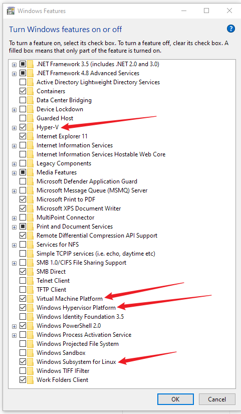

---
tags:
    - Docker
    - Docker Desktop
    - Instalacja
    - Windows
    - FAQ
---

# Problemy Docker Desktop

## Co potrzebuję, żeby zainstalować Docker Desktop?
1. Komputer z systemem Windows 10 lub 11. Ważne, żeby system był zaktualizowany – sprawdź to w ustawieniach w sekcji `Aktualizacje Windows`. 
2. Potrzebujesz też trochę miejsca na dysku (około 10 GB).
3. Przeglądarka internetowa Chrome, Edge. U wielu użytkowników są problemy podczas używania Safari.

## Sprawdź funkcje systemu Windows (przed instalacją)
Zanim zainstalujesz Docker Desktop, upewnij się, że wymagane funkcje Windows są włączone:

1. Otwórz okno funkcji Windows: w menu Start wpisz `Włącz lub wyłącz funkcje systemu Windows` (po angielsku: `Enable or disable Windows features`).
2. Sprawdź, czy zaznaczone są następujące pozycje:
    - Hyper-V
    - Virtual Machine Platform
    - Windows Hypervisor Platform
    - Windows Subsystem for Linux
    
3. Zatwierdź zmiany i — jeśli system o to poprosi — zrestartuj komputer.

Jeśli po zastosowaniu tych kroków nadal pojawiają się błędy związane z wirtualizacją, przejdź do konfiguracji w BIOS i włącz `Intel Virtualization Technology (VMX)` – szczegóły poniżej w sekcji [Ustawienie w BIOS Intel Virtualization Technology (VMX)](#bios-vmx).

## Skąd pobrać Docker Desktop?
Wejdź na oficjalną stronę Docker: ([www.docker.com](https://docker.com)). Kliknij przycisk `Download Docker Desktop` – wybierz wersję dla Windows (najczęściej będzie to wersja AMD64). Plik się pobierze, a Ty musisz go potem otworzyć.

## Co zrobić, jeśli instalacja się nie zaczyna?
Sprawdź, czy pobrałeś cały plik – czasem internet przerywa i plik jest uszkodzony. Jeśli nic się nie dzieje po kliknięciu, upewnij się, że masz uprawnienia administratora. Kliknij prawym przyciskiem myszy na plik instalacyjny i wybierz `Uruchom jako administrator`.

## Problemy z WSL 2
**Problem:** Instalator informuje, że WSL 2 jest wymagane, a nie zostało znalezione.

**Co to jest WSL 2?** WSL 2 (Windows Subsystem for Linux wersja 2) to funkcja systemu Windows, która pozwala uruchamiać programy linuxowe w Windows. Docker potrzebuje tej funkcji, aby działać poprawnie.

**Rozwiązanie:**

1. Otwórz PowerShell jako administrator

    

2. Wpisz po kolei takie komendy potwierdzając je Enterem:  

    ```powershell
    wsl --shutdown
    wsl --install -d Ubuntu-22.04
    ```

3. Zrestartuj komputer.

To automatycznie zainstaluje WSL 2 i jeśli Docker Desktop nie dokończy sam instalacji to należy go odinstalować i **zainstalować ponownie** od nowa (patrz punkt **Instalacja się zawiesza**).

<a id="bios-vmx"></a>
## Ustawienie w BIOS Intel Virtualization Technology (VMX)

**Co to jest BIOS?** BIOS to specjalny program uruchamiany podczas startu komputera, zanim włączy się Windows. Pozwala na zmianę podstawowych ustawień sprzętowych komputera, takich jak włączenie funkcji wirtualizacji, która jest potrzebna dla Docker Desktop.

1. Wejdź do BIOS, podczas uruchamiania komputera naciskaj kilkukrotnie `F2` lub inny przycisk zależnie od producenta komputera

    

2. Wybierz `Advanced`, następnie `CPU Configuration` lub `Configuration` w starszych komputerach, wyszukaj linijki `Intel Virtualization Technology (VMX)` i wybierz `Enabled`

3. Teraz musisz wyjść z BIOS zapisując zmiany. Czyli najpierw na górze strony przycisk `Exit`, a następnie `Save and Exit`

## Instalacja się zawiesza – co robić?
Spróbuj zamknąć inne programy, które mogą obciążać komputer, np. przeglądarkę z wieloma kartami. Jeśli to nie pomoże, to sprawdź w zainstalowanych aplikacjach Windows czy już częściowo Docker się nie zainstalował. Odinstaluj go, uruchom komputer ponownie i spróbuj jeszcze raz.

1. Otwórz panel Aplikacje:

    

2. Znajdź Docker Desktop, kliknij na `...` z prawej strony i wybierz `Odinstaluj`

    

3. Zrestartuj komputer i zacznij proces instalacji od nowa.


## Problem z VPN, proxy (HTTP code 401, 500)
**Problem:** Docker nie może połączyć się z serwerem `docker.io`

**Rozwiązanie:**

1. Wyloguj się z Docker Desktop. W tym celu kliknij w swój awatar w prawym górnym rogu [1], a następnie kliknij `Sign out` [2]:

    

2. Zamknij program Docker Desktop, otwórz go i zaloguj się jeszcze raz.

3. Jeśli to nie pomoże, to zamknij Docker Desktop i zrestartuj komputer.

4. Jeśli nadal jest problem, to otwórz terminal w Docker Desktop: 

    

    

5. Wpisz i uruchom kolejno takie komendy:

    ```bash
    netsh int ip reset
    netsh winsock reset
    netsh winhttp reset proxy
    ```

6. Po wykonaniu tych komend należy ponownie **zrestartować komputer** aby zmiany ustawień zostały prawidłowo zastosowane.

## Konflikt z programem antywirusowym lub zaporą
**Problem:** Instalacja zatrzymuje się lub Docker nie startuje.

**Rozwiązanie:**

1. Tymczasowo wyłącz oprogramowanie zabezpieczające (np. Windows Defender, Avast).

2. Po instalacji dodaj Docker Desktop do wyjątków.


## Jak sprawdzić, czy Docker Desktop działa?

Po instalacji Docker Desktop działa w tle jako usługa systemowa. Aby sprawdzić jego status:

1. **Sprawdź ikonę w trayu systemowym** - w prawym dolnym rogu ekranu, obok zegarka, powinna być widoczna ikona Docker (mały wieloryb). Jeśli nie widzisz ikony, kliknij strzałkę w górę `^` aby rozwinąć ukryte ikony.

    

2. **Status "Docker Desktop running"** - po najechaniu kursorem na ikonę powinien pojawić się tooltip z napisem "Docker Desktop running".

3. **Kliknij na ikonę Docker** - jeśli się otwiera panel zarządzania i nie pokazuje błędów, oznacza to, że Docker działa poprawnie.

**Ważna informacja:** Po zamknięciu okna Docker Desktop aplikacja **nie wyłącza się całkowicie** – tylko minimalizuje się do trayu systemowego i nadal działa w tle. To normalne zachowanie, które pozwala na ciągłe działanie kontenerów bez konieczności utrzymywania otwartego okna aplikacji.

Aby całkowicie wyłączyć Docker Desktop:
- Kliknij prawym przyciskiem myszy na ikonę w trayu
- Wybierz `Quit Docker Desktop`

## Docker Desktop nie uruchamia się po instalacji
**Problem:** Po zainstalowaniu nie pojawia się okno aplikacji.

**Rozwiązanie:**

1. Sprawdź w Menedżerze zadań `Ctrl + Alt + Del` wybierz `Procesy` w polu wyszukiwarki wpisz "docker" i sprawdź czy masz jakieś uruchomione procesy.

2. Mogą tam być uruchomione `Docker Desktop` lub `com.docker.backend`.

3. Zamknij je klikając prawym klawiszem myszy i wybierając `Zamknij zadanie`.

## Jak sprawdzić ustawienia kontenera Docker Desktop
**Zagadnienie**: Chcę sprawdzić ustawienia mojego kontenera takie jak `komenda` czy `zmienne środowiskowe`

**Rozwiązanie**

1. W Docker Desktop wejdź w `Containers`, żeby zobaczyć uruchomione kontenery
    

1. Kliknij w nazwę kontenera, który chcesz sprawdzić
    

1. Kliknij w zakładkę `Inspect`, żeby zobaczyć ustawienia kontenera
    

1. Kliknij w zakładkę `Env` żeby zobaczyć ustawienia `zmiennych środowiskowych`
    

## Każdy problem
Napotkając jakikolwiek problem podczas instalacji lub działania Docker Desktop warto przedstawić swój problem dla chata AI (Chat GPT, Claude, Grok). Warto wtedy dodać, że nie jest się informatykiem i żeby odpowiedział prostym językiem, z opisaniem wszystkich potrzebnych kroków.
