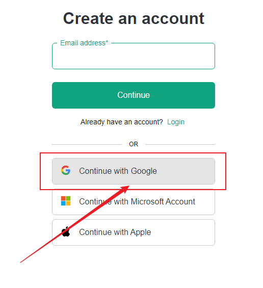

---
tags:
    - Moduł 1
    - OpenAI
    - Klucz API
    - Secret key
    - API key
    - Organization
    - Weryfikacja
    - gpt-image-1
    - Persona
    - Forbidden
    - Credentials
    - Błąd 403
---

# **OpenAI - klucz API, logowanie**

**OpenAI** to niezależna organizacja badawcza zajmująca się sztuczną inteligencją (AI). Została założona w grudniu 2015 roku z misją promowania i tworzenia przyjaznej dla człowieka sztucznej inteligencji na korzyść całej ludzkości.

## **Nie wiem gdzie wygenerować swój klucz API**

1. Zaloguj się do platformy poprzez [link](https://platform.openai.com/).
1. Po zalogowaniu przejdź do zakładki `Dashboard`.

    

1. Następnie udaj się do sekcji `API keys`.

    

1. Kliknij na przycisk `Create new secret key` i stwórz swój pierwszy klucz API.

    

## **Mam problem z zalogowaniem się do platformy OpenAI**

Jeśli masz problem z zalogowaniem się do platformy OpenAI, spróbuj zalogować się za pomocą konta Google. W tym celu:

   * przejdź do [panelu logowania](https://platform.openai.com/signup),
   * kliknij przycisk `Continue with Google`,

    

   * wybierz konto Google, z którego chcesz się zalogować.

    

## **Jak skonfigurować Organization Name w platformie OpenAI**

Podczas tworzenia konta w platformie OpenAI konieczne jest skonfigurowanie nazwy organizacji. Oto jak to zrobić:

1. Po zalogowaniu do OpenAI, jeśli pojawi się ekran powitalny, kliknij przycisk `Start building` w prawym górnym rogu strony.

    
    
    > **Uwaga:** W tej lekcji wideo ten proces jest opisany od czasu 3:23.
    > 
    > 

1. Na ekranie tworzenia organizacji:

    

    

   * W polu `Organization name` wpisz nazwę, pod którą będą widoczne wszystkie Twoje zasoby. To nazwa tylko dla Ciebie, możesz wpisać dowolną.
   * W polu `What best describes you?` wybierz opcję `Not technical`
   * Kliknij przycisk `Create organization`

1. Po utworzeniu organizacji, platforma przeprowadzi Cię przez kilka dodatkowych kroków:

   * Na ekranie `Invite your team` wybierz opcję `I'll invite my team later`

   * Na ekranie `Make your first API call` wybierz opcję `I'll do this later`

   * Na ekranie `Add some API credits` wybierz opcję `I'll buy credits later`

1. Po wykonaniu tych kroków znajdziesz się na stronie głównej platformy OpenAI dla deweloperów, gdzie możesz zacząć korzystać z API.

    

## **Błąd "Forbidden - perhaps check your credentials?" przy generowaniu obrazów z modelem gpt-image-1**

Jeśli podczas próby generowania lub edytowania obrazów za pomocą modelu `gpt-image-1` otrzymujesz błąd podobny do poniższego:

### Przyczyna problemu:

Model `gpt-image-1` wymaga **zweryfikowanej organizacji** w OpenAI. Błąd `403 - Forbidden` z komunikatem o sprawdzeniu credentials wskazuje, że Twoja organizacja nie została jeszcze zweryfikowana przez OpenAI.

### Rozwiązanie:

**Krok 1: Rozpoczęcie procesu weryfikacji**

- Przejdź do ustawień organizacji: [https://platform.openai.com/settings/organization/general](https://platform.openai.com/settings/organization/general)

    

- W sekcji **"Verifications"** kliknij przycisk **"Verify Organization"**

    

**Krok 2: Weryfikacja tożsamości przez Persona**

- Zostaniesz przekierowany do systemu weryfikacji Persona. Kliknij **"Start ID Check"**

    

- Zapoznaj się z informacjami o przetwarzaniu danych i zaznacz zgodę na przetwarzanie danych biometrycznych. Następnie kliknij **"Begin verifying"**

    

**Krok 3: Weryfikacja na urządzeniu mobilnym**

- System wyświetli kod QR do skanowania telefonem. Zeskanuj kod aparatem telefonu

    

- Alternatywnie możesz kliknąć **"Send Email"** aby otrzymać link weryfikacyjny na email

**Krok 4: Proces weryfikacji**

### ⚠️ Informacje o bezpieczeństwie procesu weryfikacji

!!! warning "Uwagi dotyczące bezpieczeństwa"
    Proces weryfikacji wymaga podania wrażliwych danych osobowych:
    
    **Co będzie wymagane:**

    - Zdjęcie dokumentu tożsamości (dowód osobisty, paszport lub prawo jazdy)
    - Zdjęcie Twojej twarzy (selfie) w celu weryfikacji biometrycznej
    - Podstawowe dane osobowe
    
    **Środki bezpieczeństwa:**

    - OpenAI używa zewnętrznego dostawcy (Persona) do weryfikacji tożsamości
    - Dane są przetwarzane zgodnie z polityką prywatności Persona i OpenAI
    - Informacje biometryczne są przechowywane maksymalnie 7 dni zgodnie z polityką
    
    **Potencjalne ryzyka:**

    - Przesyłanie dokumentów tożsamości przez internet zawsze niesie pewne ryzyko
    - Dane mogą być wykorzystane przez OpenAI do innych celów zgodnie z ich polityką prywatności
    - Brak możliwości cofnięcia weryfikacji po jej przeprowadzeniu

!!! tip "Rekomendacje"
    - Przeczytaj uważnie politykę prywatności przed rozpoczęciem weryfikacji
    - Upewnij się, że korzystasz z oficjalnej strony OpenAI
    - Rozważ czy korzystanie z modelu `gpt-image-1` jest niezbędne dla Twoich potrzeb
    - W przypadku wątpliwości skonsultuj się z ekspertem ds. ochrony danych

**Krok 5: Potwierdzenie weryfikacji**

Po pomyślnym przejściu przez proces weryfikacji tożsamości, status Twojej organizacji zmieni się na **"Organization Verified"**

### Czas propagacji zmian

!!! info "Ważne"
    Po pomyślnej weryfikacji może upłynąć **do 15 minut** zanim dostęp do modelu `gpt-image-1` zostanie aktywowany. Jeśli po tym czasie nadal otrzymujesz błąd, spróbuj:
    
    1. Odświeżyć stronę platformy OpenAI
    2. Sprawdzić status weryfikacji w ustawieniach organizacji
    3. Skontaktować się z pomocą techniczną OpenAI jeśli problem persystuje