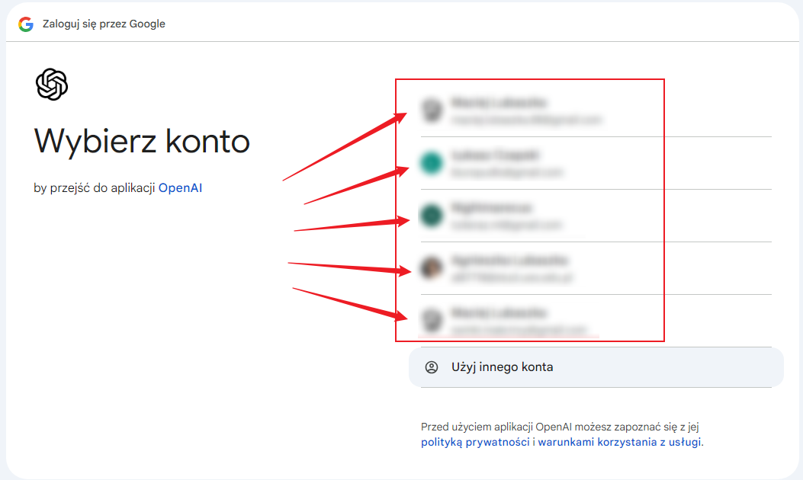

---
tags:
    - Moduł 1
    - OpenAI
    - Klucz API
    - Secret key
    - API key
    - Organization
---

# **OpenAI - klucz API, logowanie**

**OpenAI** to niezależna organizacja badawcza zajmująca się sztuczną inteligencją (AI). Została założona w grudniu 2015 roku z misją promowania i tworzenia przyjaznej dla człowieka sztucznej inteligencji na korzyść całej ludzkości.

## **Nie wiem gdzie wygenerować swój klucz API**

1. Zaloguj się do platformy poprzez [link](https://platform.openai.com/).
1. Po zalogowaniu przejdź do zakładki `Dashboard`.

    

1. Następnie udaj się do sekcji `API keys`.

    

1. Kliknij na przycisk `Create new secret key` i stwórz swój pierwszy klucz API.

    

## **Mam problem z zalogowaniem się do platformy OpenAI**

Jeśli masz problem z zalogowaniem się do platformy OpenAI, spróbuj zalogować się za pomocą konta Google. W tym celu:

   * przejdź do [panelu logowania](https://platform.openai.com/signup),
   * kliknij przycisk `Continue with Google`,

    

   * wybierz konto Google, z którego chcesz się zalogować.

    

## **Jak skonfigurować Organization Name w platformie OpenAI**

Podczas tworzenia konta w platformie OpenAI konieczne jest skonfigurowanie nazwy organizacji. Oto jak to zrobić:

1. Po zalogowaniu do OpenAI, jeśli pojawi się ekran powitalny, kliknij przycisk `Start building` w prawym górnym rogu strony.

    

2. Na ekranie tworzenia organizacji:

    

    

   * W polu `Organization name` wpisz nazwę, pod którą będą widoczne wszystkie Twoje zasoby. To nazwa tylko dla Ciebie, możesz wpisać dowolną.
   * W polu `What best describes you?` wybierz opcję `Not technical`
   * Kliknij przycisk `Create organization`

3. Po utworzeniu organizacji, platforma przeprowadzi Cię przez kilka dodatkowych kroków:

   * Na ekranie `Invite your team` wybierz opcję `I'll invite my team later`

   * Na ekranie `Make your first API call` wybierz opcję `I'll do this later`

   * Na ekranie `Add some API credits` wybierz opcję `I'll buy credits later`

4. Po wykonaniu tych kroków znajdziesz się na stronie głównej platformy OpenAI dla deweloperów, gdzie możesz zacząć korzystać z API.

    