---
tags:
  - Moduł 3
  - Gmail
  - Credentials
  - n8n
  - Google
  - Google Cloud Platform
  - Client Id
  - Client Secret
  - OAuth
  - Autoryzacja
  - Incognito
  - Błąd 401
---

# **Rozwiązania problemów z credentials Google**

## **Credentials Gmail / Google Drive / Google Sheets - nie wiem jak dodać Client Id i Client Secret**
1. Zaloguj się do google cloud platform [link](https://console.cloud.google.com/).
1. Następnie podążaj za instrukcją z tego wideo
   <div class="video-wrapper">
    <iframe width="1280" height="720" src="https://www.youtube.com/embed/k5FOdX_LaDo?si=mJTctvD5Cx_7drrg" title="YouTube video player" frameborder="0" allow="accelerometer; autoplay; clipboard-write; encrypted-media; gyroscope; picture-in-picture; web-share" referrerpolicy="strict-origin-when-cross-origin" allowfullscreen></iframe>
    </div>


## **Credentials Google - nie mogę pobrać Client Secret z Google Cloud Platform**
Kiedy otwieram credentials w Google Cloud Platform to nie mogę skopiować Client Secret ponieważ jest zaszyfrowany ( oznaczony gwiazdkami )
   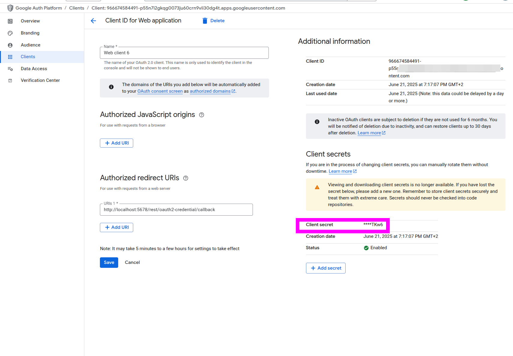
**Dlaczego tak się dzieje?**
Google Cloud Platform zmieniło politykę przechowywania danych i teraz użytkownik jest odpowiedzialny za bezpieczne przechowywanie swojego sekretu ( `Client Secret` ). Przez tę zmianę Google pozwala pobrać `Client Secret` jedynie w momencie tworzenia credentials.

**Co należy zrobić?**

1. Otwórz **nowe** credentials w Google Cloud Platform. Wybieramy `Create credentials`
   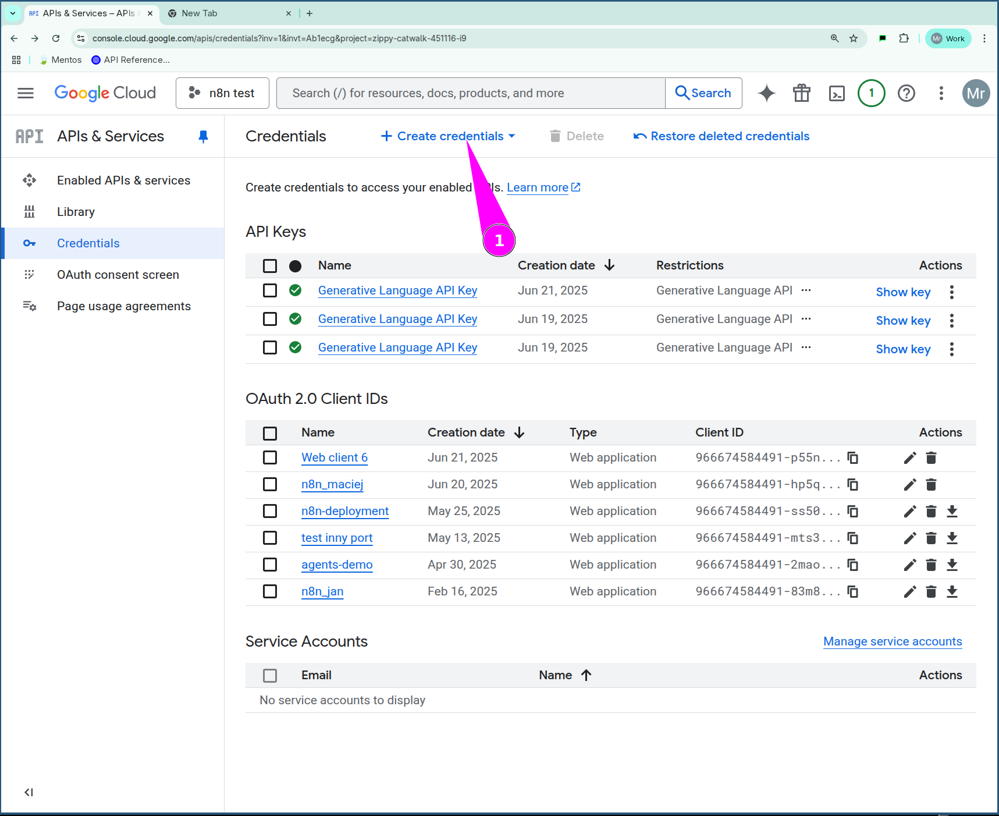
   A następnie z listy wybieramy `OAuth client ID`
   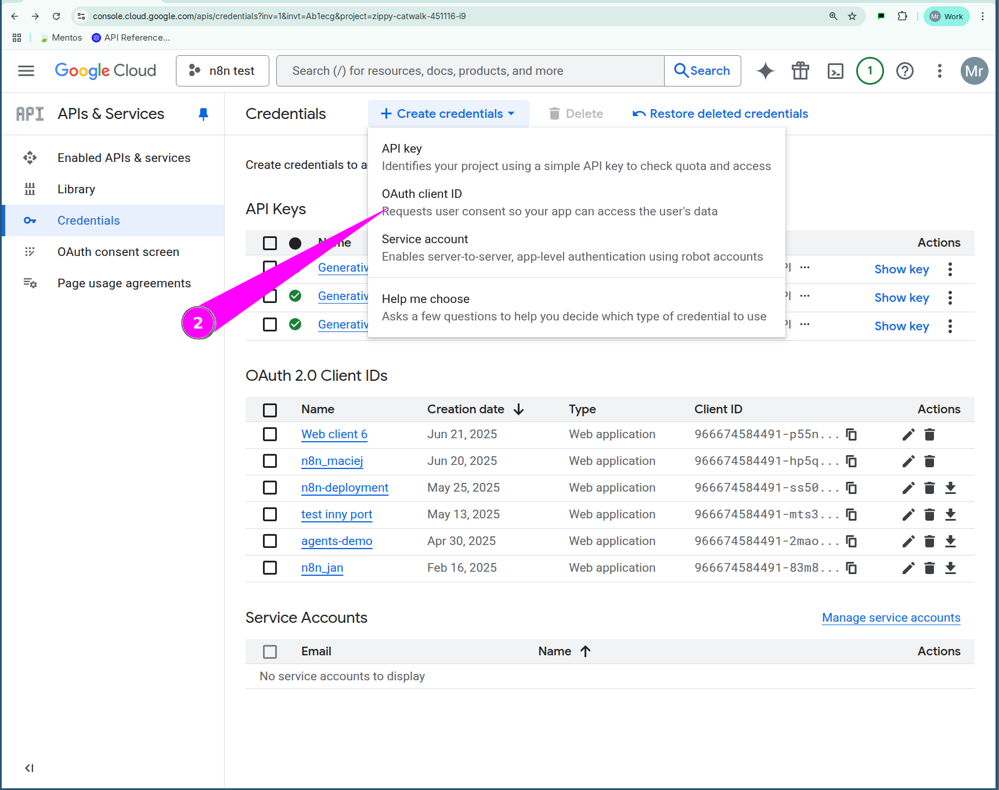

1. W kolejnym kroku wybieramy `Web application`, ustalamy nazwę naszych Credentials, ustawiamy `Authorized redirect URIs` na `http://localhost:5678/rest/oauth2-credential/callback`
   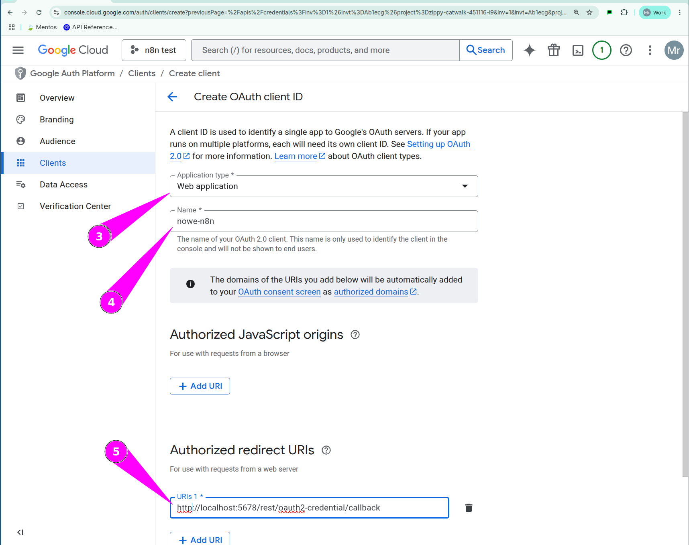

1. A następnie klikamy na `Create`
   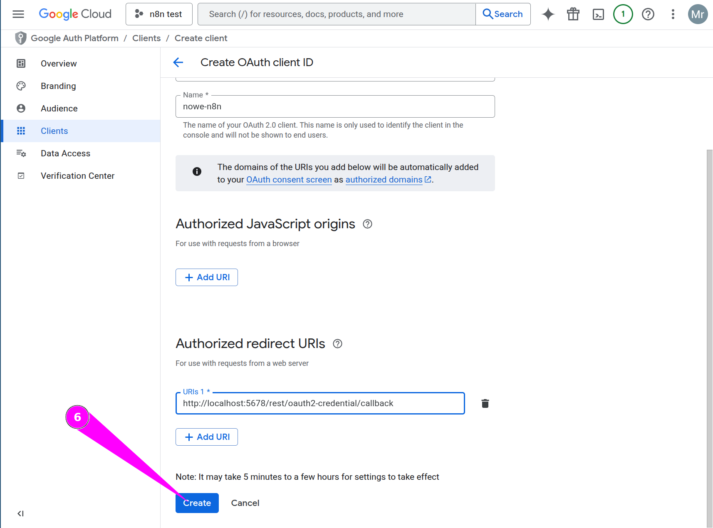

1. W kolejnym kroku pojawią się nasze dane dostępowe ( czyli `Client ID` i `Client Secret` ). Należy je skopiować i zapisać w bezpiecznym miejscu.
   Można również je pobrać jako plik klikając na `Download JSON`. Wartości `Client ID` i `Client Secret` warto wpisać od razu do credentials w n8n.
   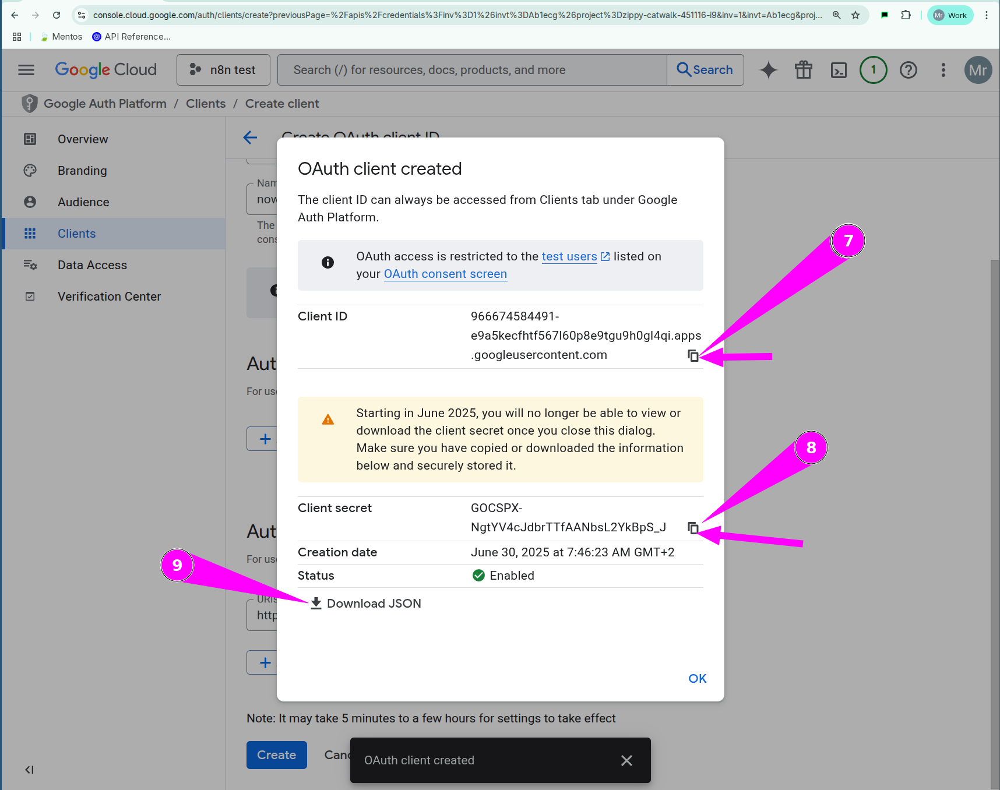
   **Proces ustawiania credentials w n8n został opisany w tym samouczku**
   [Kliknij, żeby przejść do instrukcji](../04_credentiale_credentials_problems/#credentials-gmail-google-drive-google-sheets-nie-wiem-jak-dodac-client-id-i-client-secret)
## **Credentials Gmail - Node Gmail nie działa i zwraca błąd przy wywołaniu workflow**

1. Jeśli widzisz taki błąd
   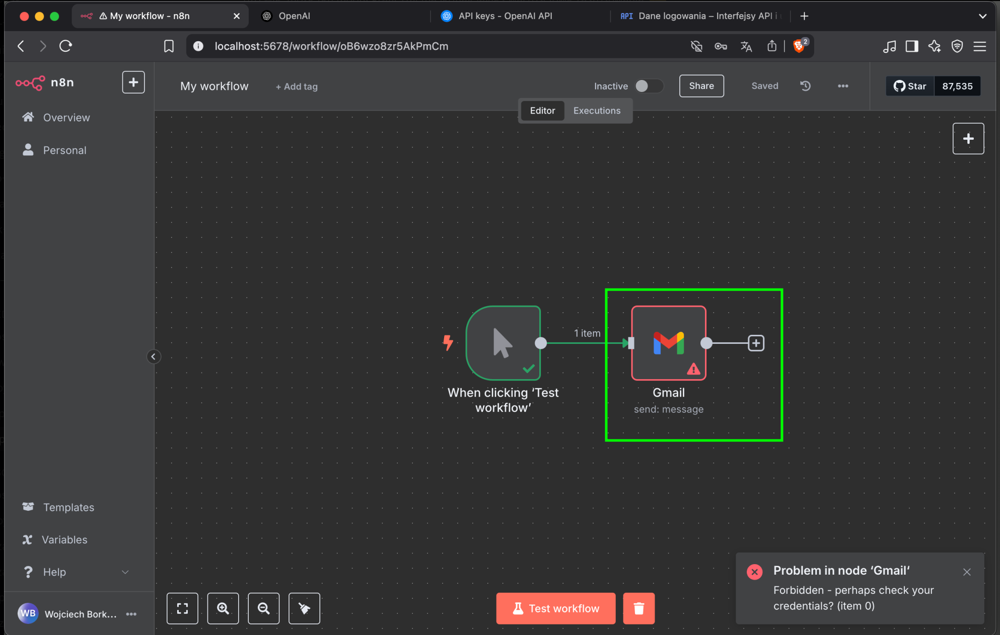
   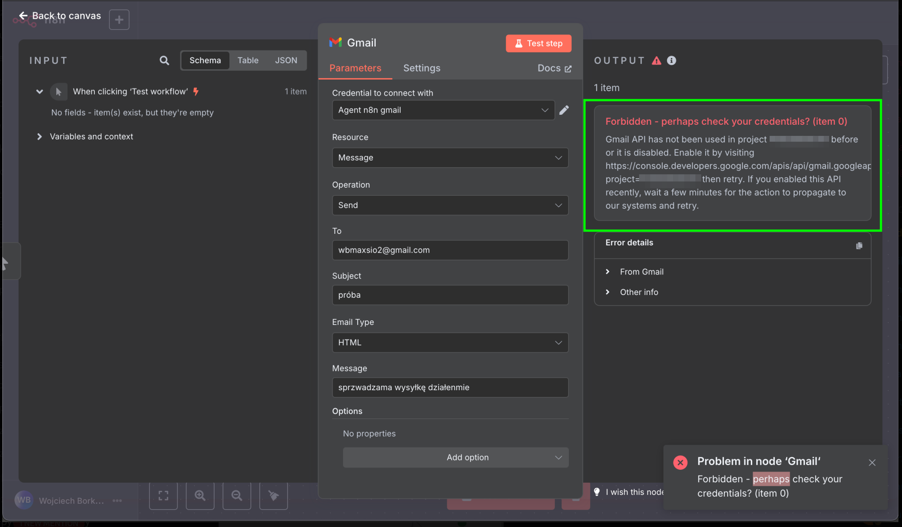

1. Zaloguj się do google cloud platform [link](https://console.cloud.google.com/).
1. Następnie podążaj za instrukcją z tego wideo
    <div class="video-wrapper">
    <iframe width="1280" height="720" src="https://www.youtube.com/embed/DT8ynTz9xuI?si=V1z3qWngLAfqNvYP" title="YouTube video player" frameborder="0" allow="accelerometer; autoplay; clipboard-write; encrypted-media; gyroscope; picture-in-picture; web-share" referrerpolicy="strict-origin-when-cross-origin" allowfullscreen></iframe>
    </div>

## **Node Google Sheet nie widzi listy dokumentów**

1. Jeśli rozwijasz w polu **Document** listę **From List** i widzisz taki błąd
   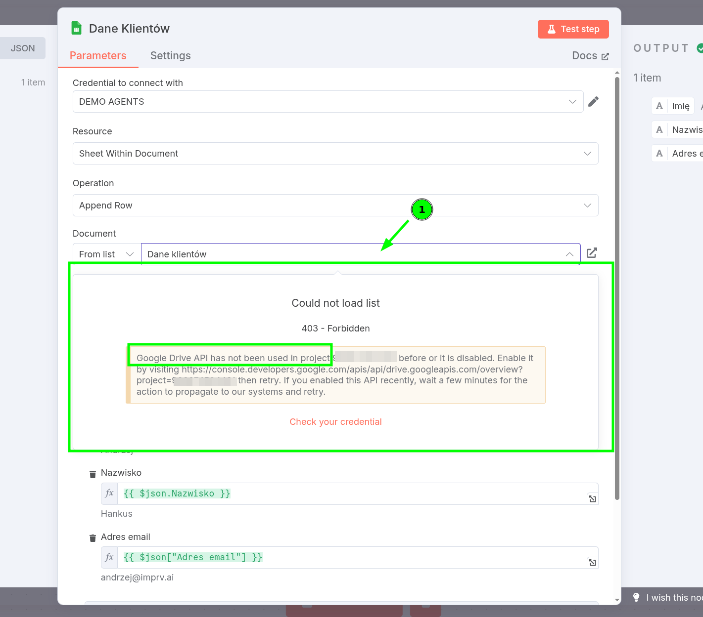
   **Oznacza to, że należy włączyć serwis Google Drive API** 
1. Zaloguj się do google cloud platform [link](https://console.cloud.google.com/).
1. Następnie podążaj za instrukcją z tego wideo
    <div class="video-wrapper">
    <iframe width="1280" height="720" src="https://www.youtube.com/embed/O7QV6X8H1uk?si=QUOOzcxJxuKSwuky" title="YouTube video player" frameborder="0" allow="accelerometer; autoplay; clipboard-write; encrypted-media; gyroscope; picture-in-picture; web-share" referrerpolicy="strict-origin-when-cross-origin" allowfullscreen></iframe>
    </div>

## **Credentials Google Sheet / Gmail/ Google Drive nie działają po ustawieniu `WEBHOOK_URL` i uruchomieniu `ngrok`**

1. Otwórz któryś z istniejących Credentials jakiegokolwiek serwisu Google ( np, Gmail ) i skopiuj zawartość pola `OAuth Redirect URL`
   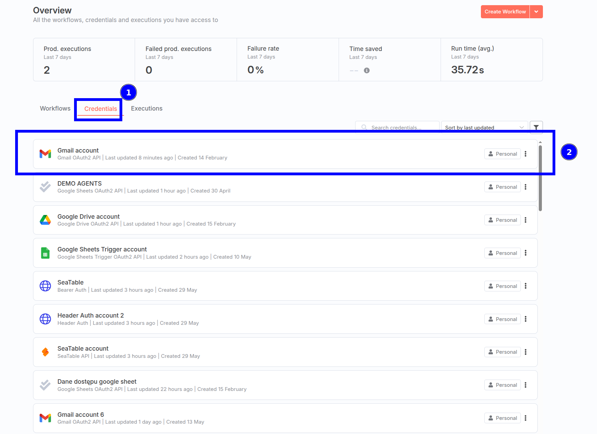
   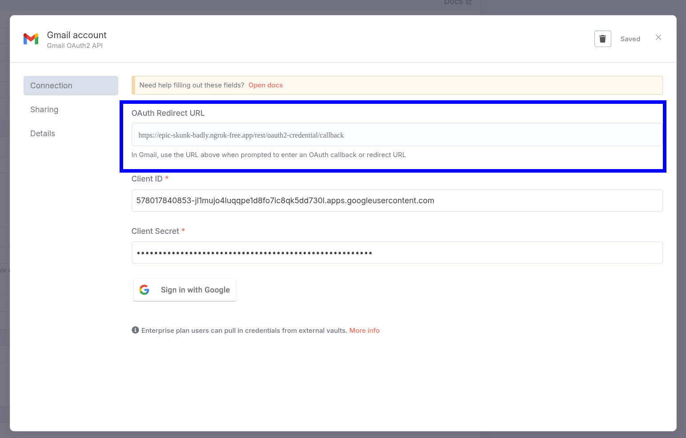

1. Otwórz swój projekt w [Google Cloud Platform](https://console.cloud.google.com/)

1. Dodaj adres skopiowany z `OAuth Redirect URL` do `Authorized Redirect URIs` w Google Cloud
   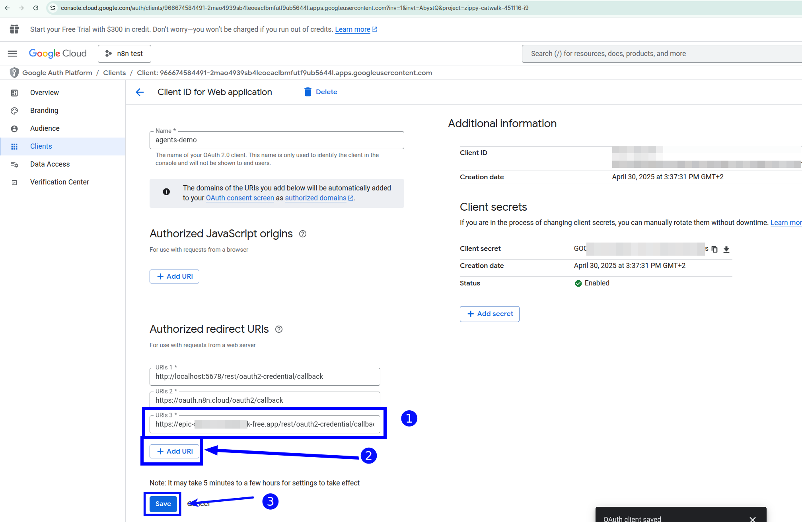

   *Jeśli potrzebujesz przypomnienia jak się poruszać po Google Cloud zerknij na
   [tę instrukcję](./#credentials-gmail-google-drive-google-sheets-nie-wiem-jak-dodac-client-id-i-client-secret)*

## **Błąd: "OAuth callback failed because of insufficient permissions" — różne porty 5678/5679**

Jeśli przy łączeniu credentials Google widzisz komunikat o błędzie w oknie callbacku i Twoje n8n działa pod `http://localhost:5679`, a w Google Cloud w `Authorized redirect URIs` masz `http://localhost:5678/rest/oauth2-credential/callback`, to problemem jest niedopasowanie portów. Port w Google Cloud musi być taki sam jak port, na którym działa n8n.

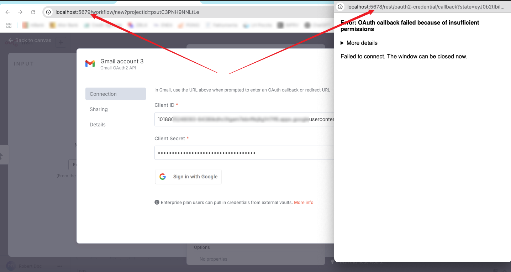

**Rozwiązanie - uruchom n8n na standardowym porcie 5678**

   1. Zatrzymaj i usuń kontener n8n działający na porcie 5679
         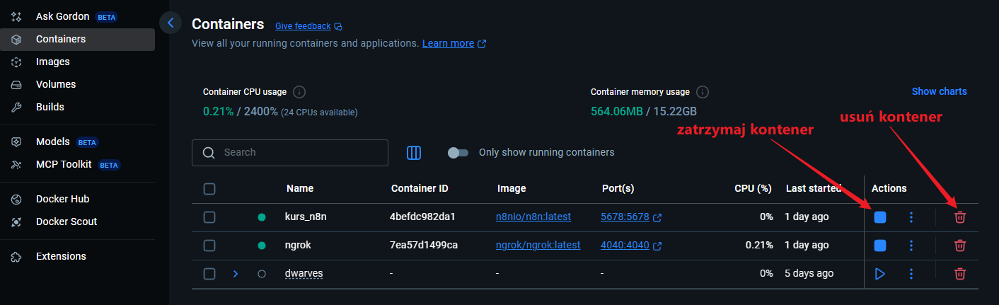

   1. Przejdź do sekcji `Images` i wybierz obraz `n8nio/n8n`
         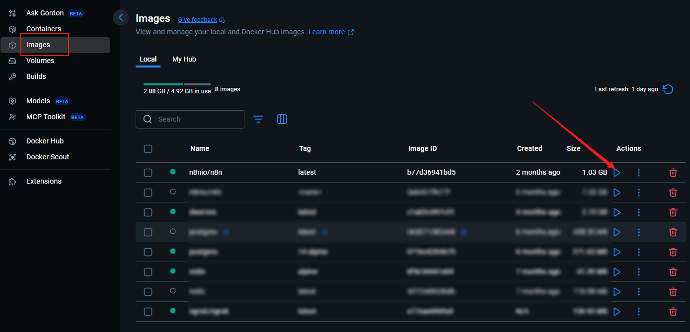

   1. Uruchom ponownie kontener n8n mapując port `5678:5678` (tak aby aplikacja była dostępna pod `http://localhost:5678`).  
         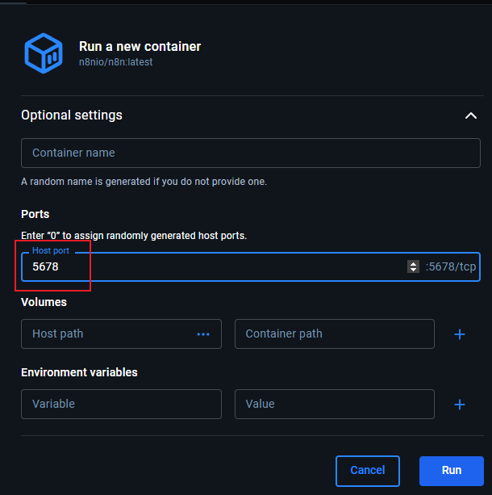

    !!! warning "Uwaga" 
        Nie zapomnij wypełnić reszty pól! 
        W przeciwnym razie n8n nie będzie działał.

   1. Upewnij się, że w Google Cloud `Authorized redirect URIs` zawiera `http://localhost:5678/rest/oauth2-credential/callback`.
         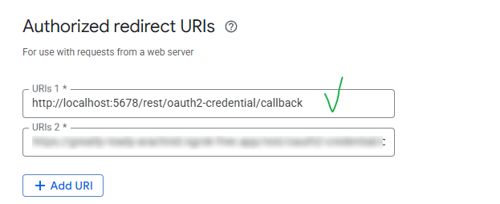

   1. Wróć do n8n i ponów `Sign in with Google`.

## **Usuwanie niepotrzebnych/niedziałających credentials z node'a w n8n**

Jeśli masz niepotrzebne lub niedziałające credentials skonfigurowane w swoim node'ie w n8n, możesz je łatwo usunąć wykonując poniższe kroki:

!!! warning "Uwaga"
    Usunięcie credentials może spowodować, że inne workflow wykorzystujące te same credentials przestaną działać. Upewnij się, że nie są używane w innych miejscach przed ich usunięciem.

1. **Otwórz ustawienia node'a z credentials** - kliknij na ikonę edycji (ołówek) w prawym górnym rogu node'a, dla którego chcesz usunąć credentials.
   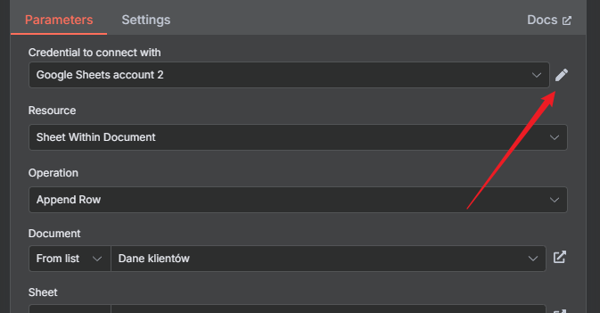

1. **Przejdź do ustawień credentials** - w oknie ustawień node'a przejdź do sekcji credentials i kliknij na ikonę kosza (usuwania) w prawym górnym rogu okna credentials.
   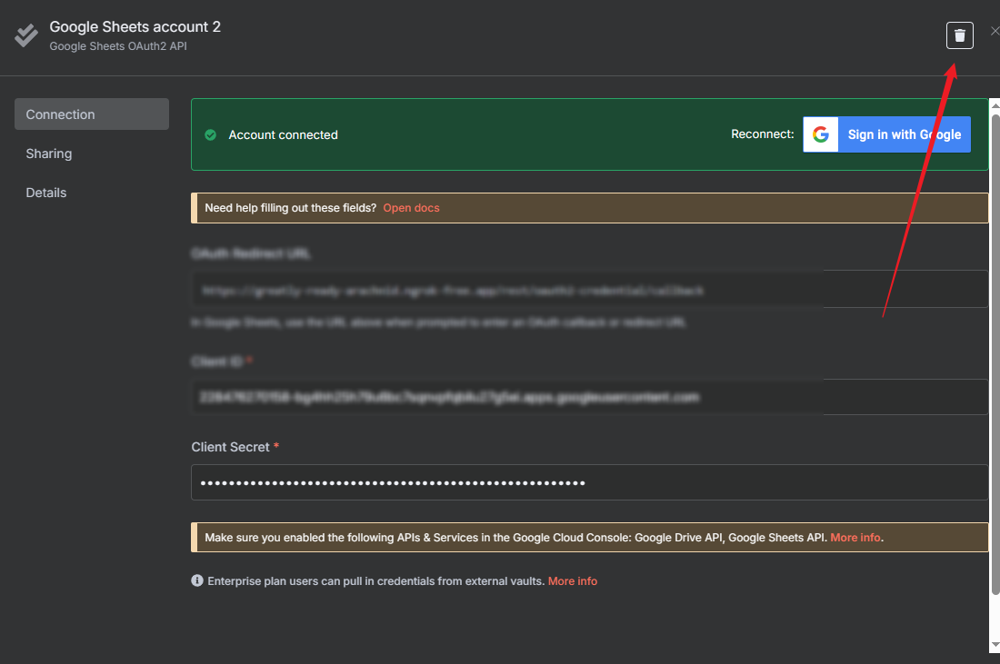

1. **Potwierdź usunięcie** - pojawi się okno dialogowe z pytaniem czy na pewno chcesz usunąć credentials. Kliknij przycisk **"Yes, delete"** aby potwierdzić usunięcie.
   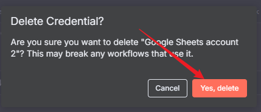

## **Błąd autoryzacji OAuth: "Dostęp zablokowany" / "The OAuth client was not found"**

Jeśli podczas próby autoryzacji z Google (Gmail, Google Drive, Google Sheets) widzisz komunikat o błędzie autoryzacji podobny do poniższego:

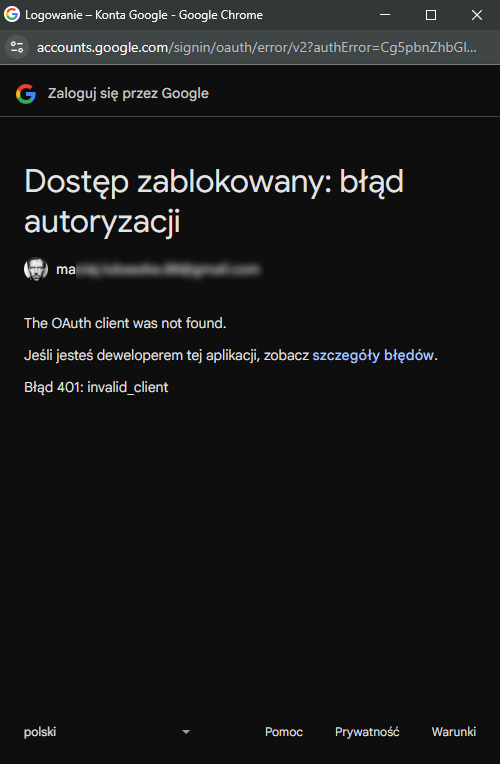

### Przyczyna problemu:

Problem najczęściej występuje gdy przeglądarka **automatycznie loguje się** na inne konto Google niż to, dla którego zostały skonfigurowane credentials w Google Cloud Platform. Może to się zdarzyć, gdy:

1. Masz zalogowanych wiele kont Google w tej samej przeglądarce
1. Przeglądarka automatycznie wybiera konto, które nie ma dostępu do skonfigurowanej aplikacji OAuth
1. Credentials zostały utworzone dla jednego konta, a próbujesz autoryzować się z poziomu innego

### Rozwiązanie:

**Użyj trybu incognito (prywatnego) w przeglądarce:**

1. **Skopiuj adres URL workflow** - skopiuj pełny adres workflow z paska adresu przeglądarki (np. `localhost:5678/workflow/C8y5bItiJVEBsXTABpH55433/48dc12`)
   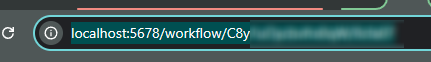

1. **Otwórz okno incognito** - otwórz nowe okno przeglądarki w trybie incognito/prywatnym:
    - **Chrome**: Ctrl+Shift+N (Windows) lub Cmd+Shift+N (Mac)
       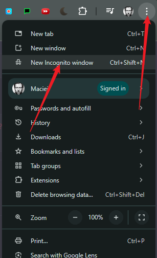
    - **Firefox**: Ctrl+Shift+P (Windows) lub Cmd+Shift+P (Mac)
    - **Edge**: Ctrl+Shift+N (Windows)

1. **Wklej adres workflow** - wklej skopiowany adres URL do paska adresu w nowym oknie incognito

1. **Ponów autoryzację** - przejdź do swojego node'a (np. Gmail) i spróbuj ponownie wykonać autoryzację OAuth

### Dlaczego to działa?

Tryb incognito zapewnia "czystą sesję" bez wcześniej zapamiętanych danych logowania, co pozwala:

   - Ręcznie wybrać właściwe konto Google
   - Uniknąć automatycznego logowania na nieprawidłowe konto  
   - Przeprowadzić autoryzację z poziomu konta, które ma dostęp do aplikacji OAuth

!!! tip "Wskazówka"
    Po pomyślnej autoryzacji w trybie incognito, możesz wrócić do zwykłego okna przeglądarki. Autoryzacja zostanie zapamiętana w n8n.

## **Błąd przy pobieraniu zdjęcia z Google Drive: "Forbidden - perhaps check your credentials?"**

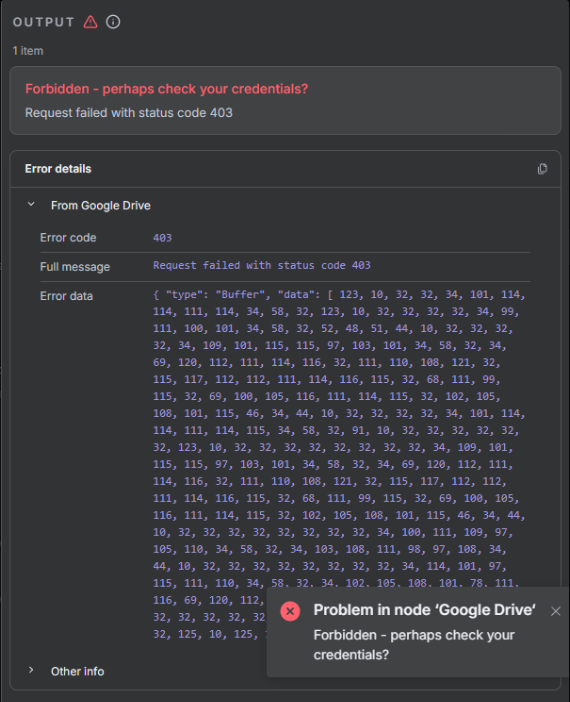

### Przyczyna problemu:

Najczęstszą przyczyną tego błędu jest używanie **ID folderu** zamiast **ID konkretnego pliku** ze zdjęciem. Gdy kopiujesz link do zdjęcia bezpośrednio z Google Drive, często otrzymujesz link zawierający ID folderu, w którym znajduje się zdjęcie, a nie ID samego pliku.

### Rozwiązanie:

**Pobierz poprawne ID zdjęcia bezpośrednio z pliku:**

1. **Otwórz plik zdjęcia w Google Drive** - znajdź swoje zdjęcie, a następnie:
    - kliknij na trzy kropki
    - wybierz opcję **"Share"**
    - wybierz opcję **"Copy link"** (Kopiuj link)
   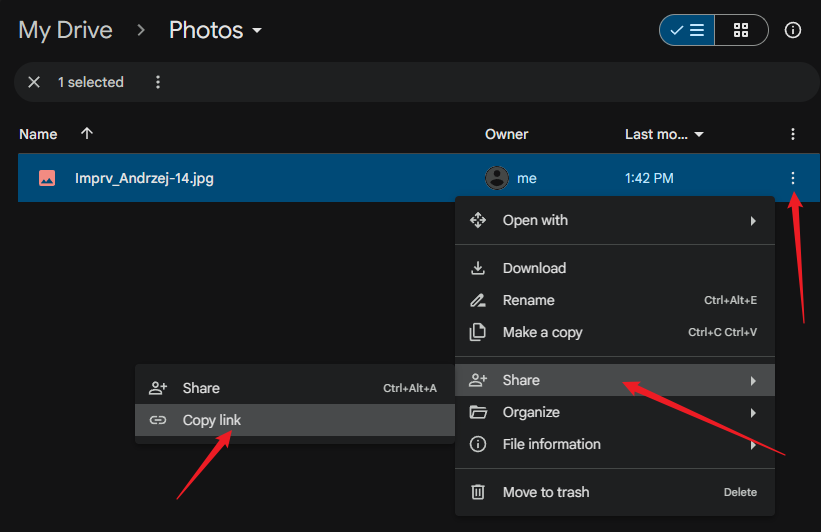

1. **Wyciągnij ID pliku z linku** - skopiowany link będzie miał format podobny do:
    ```
    https://drive.google.com/file/d/12Vidu___________YxNGvBGd/view?usp=drive_link
    ```
    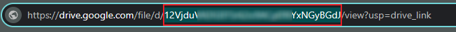

    ID pliku to część między `/d/` a `/view` - w tym przypadku: `12Vjdu___________YxNGyBGdJ`

1. **Użyj poprawnego ID w n8n** - wklej wyciągnięte ID do odpowiedniego pola w node'ie Google Drive

### Dlaczego to działa?

Google Drive wyróżnia różne typy obiektów (foldery, pliki, dokumenty), każdy z unikalnym ID.
Używając poprawnego ID pliku, Google Drive może prawidłowo zidentyfikować zasób i udostępnić go zgodnie z ustawionymi uprawnieniami.

!!! warning "Ważne"
    Upewnij się, że plik ma odpowiednie uprawnienia dostępu (jest publiczny lub udostępniony dla Twojego konta Google używanego w credentials).

