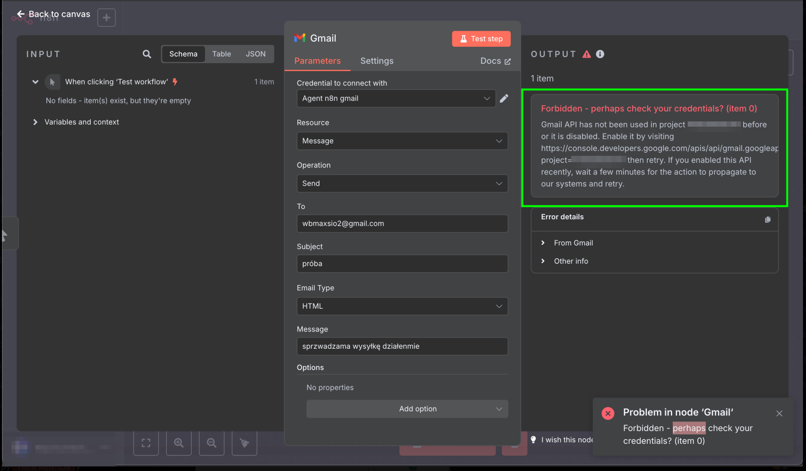

---
tags:
  - Moduł 3
  - Gmail
  - Credentials
  - n8n
  - Google
---

# **Rozwiązania problemów z credentials Google**

## **Credentials Gmail / Google Drive / Google Sheets - nie wiem jak dodać Client Id i Client Secret**
1. Zaloguj się do google cloud platform [link](https://console.cloud.google.com/).
1. Następnie podążaj za instrukcją z tego wideo
   

    <iframe width="1280" height="720" src="https://www.youtube.com/embed/k5FOdX_LaDo?si=mJTctvD5Cx_7drrg" title="YouTube video player" frameborder="0" allow="accelerometer; autoplay; clipboard-write; encrypted-media; gyroscope; picture-in-picture; web-share" referrerpolicy="strict-origin-when-cross-origin" allowfullscreen></iframe>
    

## **Credentials Gmail - Node Gmail nie działa i zwraca błąd przy wywołaniu workflow**

1. Jeśli widzisz taki błąd
   
   

1. Zaloguj się do google cloud platform [link](https://console.cloud.google.com/).
1. Następnie podążaj za instrukcją z tego wideo
    

    <iframe width="1280" height="720" src="https://www.youtube.com/embed/DT8ynTz9xuI?si=V1z3qWngLAfqNvYP" title="YouTube video player" frameborder="0" allow="accelerometer; autoplay; clipboard-write; encrypted-media; gyroscope; picture-in-picture; web-share" referrerpolicy="strict-origin-when-cross-origin" allowfullscreen></iframe>
    

## **Node Google Sheet nie widzi listy dokumentów**

1. Jeśli rozwijasz w polu **Document** listę **From List** i widzisz taki błąd
   
   **Oznacza to, że należy włączyć serwis Google Drive API** 
1. Zaloguj się do google cloud platform [link](https://console.cloud.google.com/).
1. Następnie podążaj za instrukcją z tego wideo
    

    <iframe width="1280" height="720" src="https://www.youtube.com/embed/O7QV6X8H1uk?si=QUOOzcxJxuKSwuky" title="YouTube video player" frameborder="0" allow="accelerometer; autoplay; clipboard-write; encrypted-media; gyroscope; picture-in-picture; web-share" referrerpolicy="strict-origin-when-cross-origin" allowfullscreen></iframe>
    

## **Credentials Google sheet nie działają po ustawieniu `WEBHOOK_URL` i uruchomieniu `ngrok`**

1. Otwórz któryś z istniejących Credentials jakiegokolwiek serwisu Google ( np, Gmail ) i skopiuj zawartość pola `OAuth Redirect URL`
   

   

1. Otwórz swój projekt w [Google Cloud Platform](https://console.cloud.google.com/)
1. Dodaj adres skopiowany z `OAuth Redirect URL` do `Authorized Redirect URIs` w Google Cloud
   

   *Jeśli potrzebujesz przypomnienia jak się poruszać po Google Cloud zerknij na
   [tę instrukcję](./#credentials-gmail-google-drive-google-sheets-nie-wiem-jak-dodac-client-id-i-client-secret)*