---
tags:
  - Workflow
  - Node
  - Local File Trigger
  - Elżbieta
  - Dane klientów
  - Google Sheet
  - Adam Marketingowiec
  - Generowanie grafiki
---

# **Rozwiązywanie problemów z workflowami z lekcji**

## **Workflow z czytaniem danych klientów z formularza nie działa - Google Sheet ( Dane Klientów ) nie widzi Document i Sheet**
1. Jeśli masz podświetlone na czerwono pola **Document** i **Sheet**
   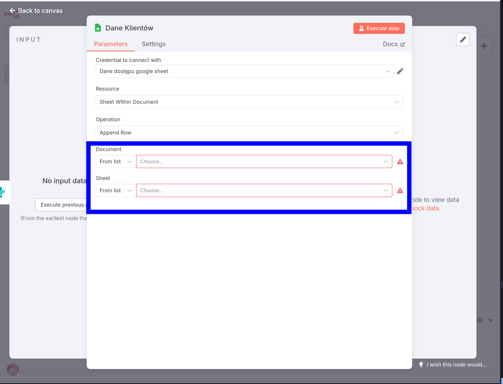

1. W pierwszej kolejności upewnij się, że masz wypełnione pole `Credentials to connect with`
   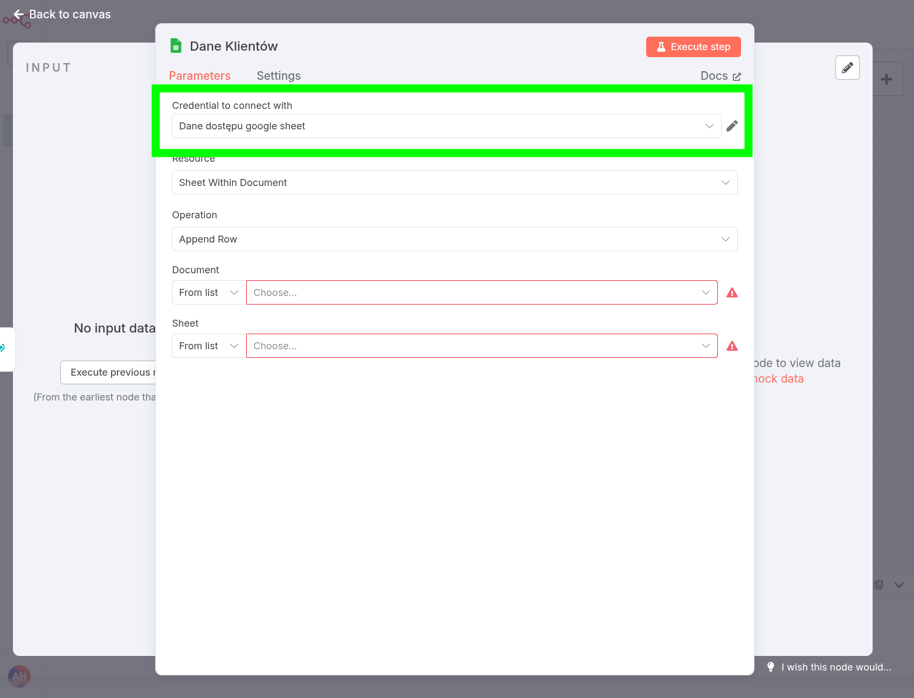

1. Jeśli pole jest wypełnione, czyli dane dostępu ( Credentials ) są podpięte, kliknij w `Choose...` w polu **Document**
Jeśli lista jest pusta, oznacza to, że podpięte dane dostępu ( Credentials ) są poprawne, ale najprowdopodobniej nie masz jeszcze żadnego utworzonego `Arkusza Google ( Google Sheet )`

1. W takiej sytuacji wejdź na stronę [Google Sheet (kliknij, żeby otworzyć stronę)](https://workspace.google.com/products/sheets/)

1. Następnie zaloguj się
   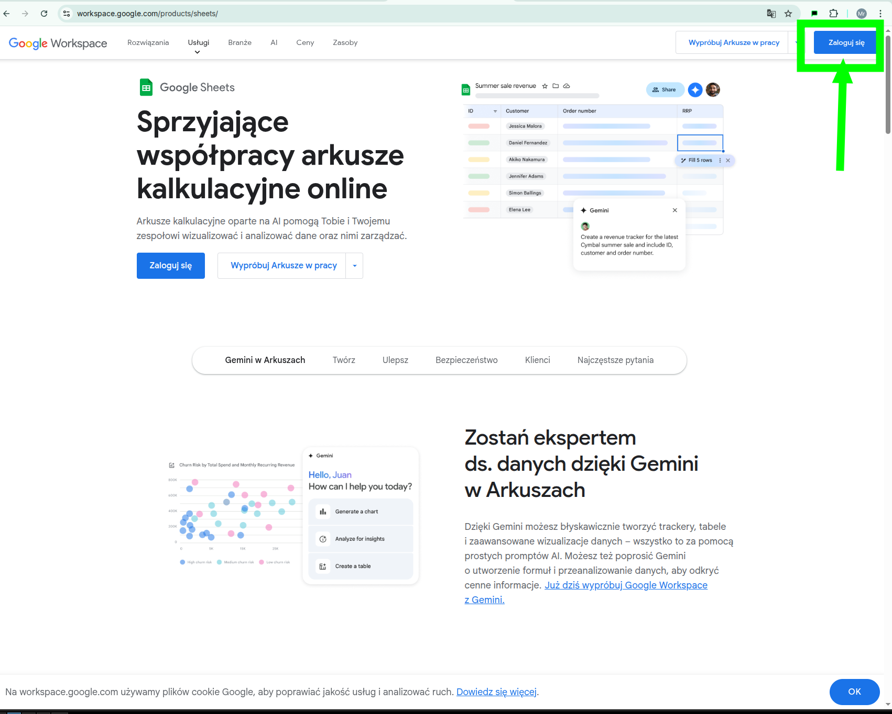

1. Kliknij znak **+ Blank spreadsheet ( Pusty arkusz)**, aby utworzyć nowy arkusz ( google sheet )
   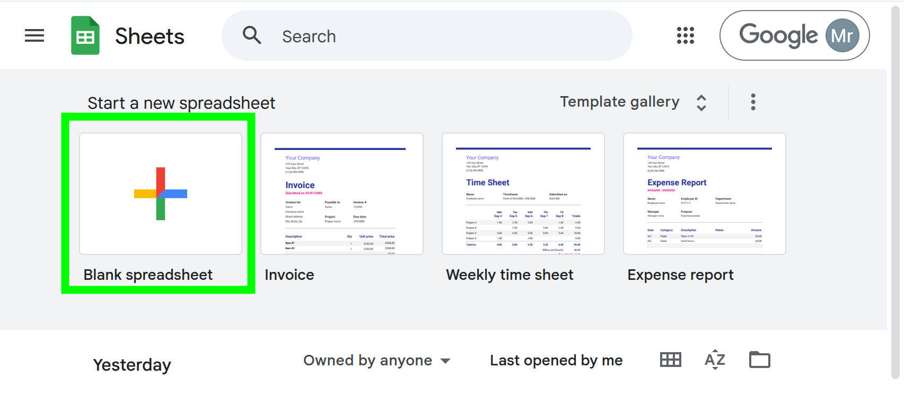

1. Kliknij dwukrotnie we wskazane miejsca żeby zmienić nazwę dokumentu (Document), nazwę arkusza (Sheet) oraz aby wstawić nazwy kolumn
   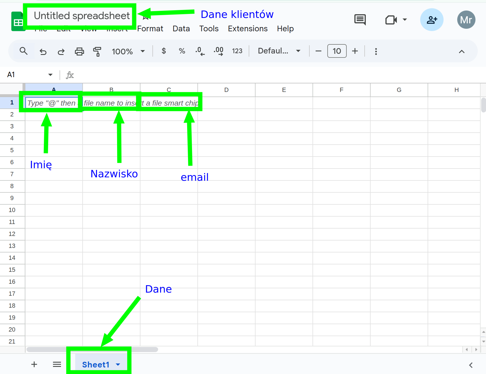

1. Po wypełnieniu powinno to wyglądać tak
   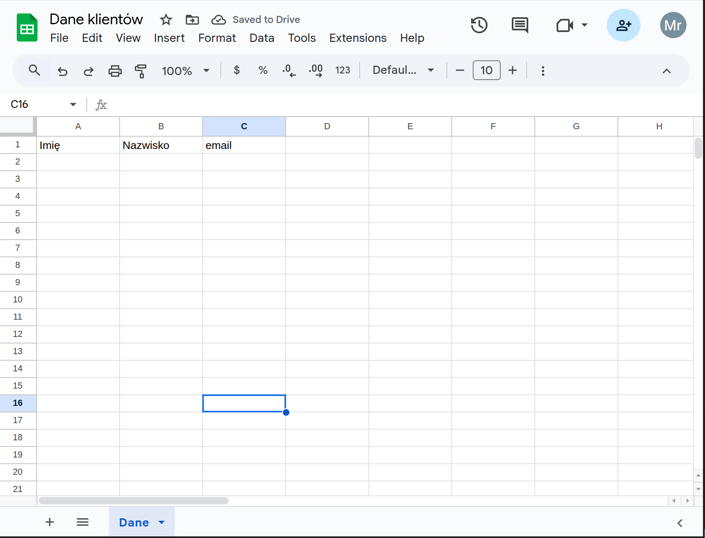

1. Następnie wróć do **n8n** i w nodzie `Dane Klientów ( Google Sheet)` kliknij w pole **Document**. Powinien się tam pojawić dokument, który właśnie został utworzony
   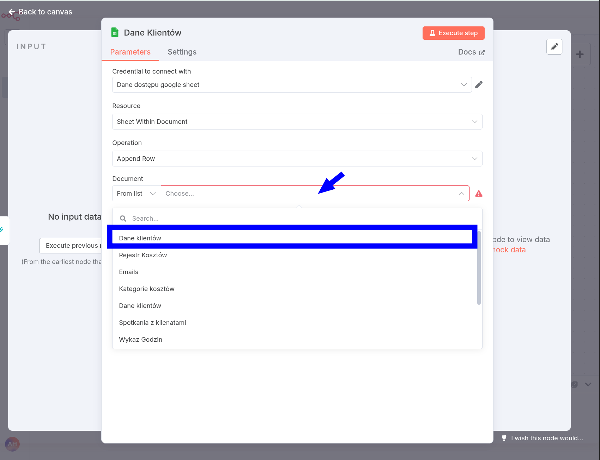

1. Następnie w polu **Sheet** wybierz nazwę arkusza w tym dokumencie. W przykładzie nazywał on się `Dane` 
   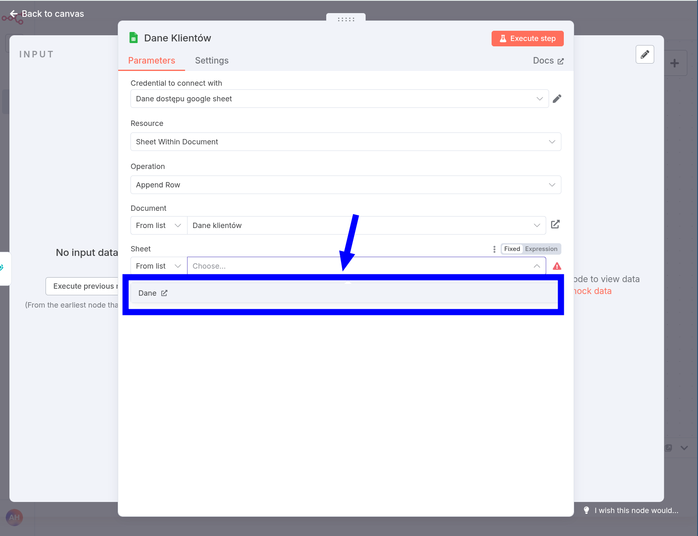

1. Po wykonaniu tej operacji pojawią się pola o takich nazwach jak kolumny w naszym utworzonym dokumencie
   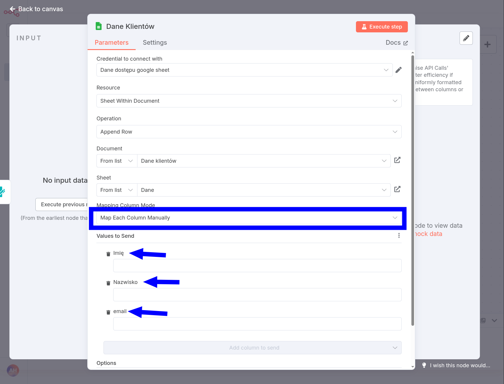

## **Workflow z czytaniem lokalnych plików nie działa - Local Files Trigger nie reaguje (WERSJA DLA SYSTEMU WINDOWS)**

1. Jeśli pracujesz na systemie Windows i masz podpięty prawidłowo wolumen do folderu `pliki_n8n`, a Local Files Trigger nie reaguje
   

1. Kliknij dwukrotnie w node `Local File Trigger`
   

1. Kliknij w `Add Option`
   

1. Z listy wybierz `Use Polling`
   

1. Kliknij w suwak tak, żeby się zaświecił na zielono
   

1. Powtórz test, przenosząc plik ze zdjęciem do folderu, i teraz powinno działać
    

    <iframe width="1280" height="720" src="https://www.youtube.com/embed/VNyzU-CtOAw?si=xKw39F_Wl0PNxz4-" title="YouTube video player" frameborder="0" allow="accelerometer; autoplay; clipboard-write; encrypted-media; gyroscope; picture-in-picture; web-share" referrerpolicy="strict-origin-when-cross-origin" allowfullscreen></iframe>
    

1. Jeśli wciąż nie działa, **usuń kontener** i spróbuj ponownie, uważając podczas **ustawiania katalogów**.
   

1. Po usunięciu kontenera przejdź do obrazów `Images` i uruchom obraz trójkątnym przyciskiem `Run`
   

1. Pokaże się okno `Run a new container`, rozwiń zakładkę `Optional settings` i wypełnij wszystkie pola zgodnie ze schematem:
      - najpierw dodaj jako **pierwszy wolumen** ten, który już istniał (pod tymi samymi ścieżkami co wcześniej)
      - jako **drugi wolumen** podepnij ten nowy folder na dodawanie plików
      

1. Aby sprawdzić, czy wszystko zrobiliśmy dobrze, w zakładce `Containers` kliknij na nazwę kontenera, a następnie w zakładkę `Bind mounts`:
   
1. Tutaj powinny być widoczne dwa foldery. Pierwszy na dane n8n, a drugi do przekazywania plików do workflow. 
   

## **Workflow z czytaniem lokalnych plików nie działa - Local Files Trigger nie reaguje (WERSJA DLA SYSTEMU macOS)**

1. Jeśli pracujesz na systemie macOS i masz podpięty prawidłowo wolumen do folderu `pliki_n8n`, a Local Files Trigger nie reaguje
   

1. Kliknij dwukrotnie w node `Local File Trigger`
   

1. Upewnij się, że suwak `Use Polling` nie jest zaznaczony i jest na szaro
   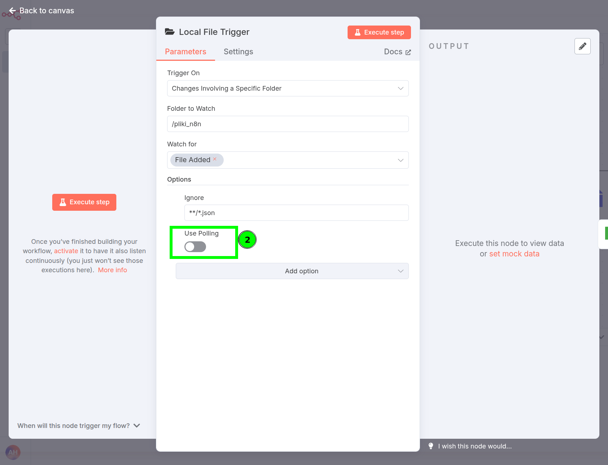

1. Powtórz test, przenosząc plik ze zdjęciem do folderu, i teraz powinno działać
    

    <iframe width="1280" height="720" src="https://www.youtube.com/embed/VNyzU-CtOAw?si=xKw39F_Wl0PNxz4-" title="YouTube video player" frameborder="0" allow="accelerometer; autoplay; clipboard-write; encrypted-media; gyroscope; picture-in-picture; web-share" referrerpolicy="strict-origin-when-cross-origin" allowfullscreen></iframe>
    

1. Jeśli wciąż nie działa, **usuń kontener** i spróbuj ponownie, uważając podczas **ustawiania katalogów**.
   

1. Po usunięciu kontenera przejdź do obrazów `Images` i uruchom obraz trójkątnym przyciskiem `Run`
   

1. Pokaże się okno `Run a new container`, rozwiń zakładkę `Optional settings` i wypełnij wszystkie pola zgodnie ze schematem:
      - najpierw dodaj jako **pierwszy wolumen** ten, który już istniał (pod tymi samymi ścieżkami co wcześniej)
      - jako **drugi wolumen** podepnij ten nowy folder na dodawanie plików
      

1. Aby sprawdzić, czy wszystko zrobiliśmy dobrze, w zakładce `Containers` kliknij na nazwę kontenera, a następnie w zakładkę `Bind mounts`:
   
1. Tutaj powinny być widoczne dwa foldery. Pierwszy na dane n8n, a drugi do przekazywania plików do workflow. 
   

## **Workflow z modułu Agentka Elżbieta - nie widzę opcji w nodzie Gmail**

1. Klikam w node Gmail i nie widzę opcji, które pokazane były na lekcji
   

1. Żeby naprawić ten problem, należy odznaczyć `Simplify` (tak, żeby było nieaktywne i nie świeciło się na zielono)
   

1. Po deaktywacji `Simplify` będziemy mogli dodać opcje (np. `Download attachments`)
   

## **Workflow z modułu Agentka Elżbieta - nie widzę zakładki Binary w nodzie Gmail po pobraniu danych**

1. Po pobraniu testowego maila z załącznikami nie widzę zakładki `Binary` w sekcji `Output`
   

1. Zakładka Binary widoczna jest jedynie w sytuacji, gdy pobrane zostaną pliki. Node nie pobierze plików, jeżeli nie zaznaczymy opcji `Download attachments`. Należy zatem zaznaczyć tę opcję i ponownie pobrać dane.
   

## **Generowanie zdjęcia w module o Adamie Marketingowcu nie działa**
Wyświetla się taki błąd:

   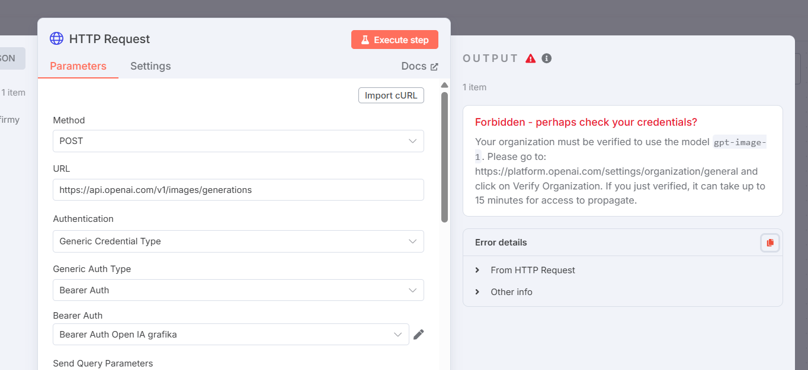

1. Błąd informuje nas o tym, że żeby użyć modelu `gpt-image-1` musimy zweryfikować naszą organizację w OpenAI.
Wymaga to zweryfikowania metody płatności i **zweryfikowania naszej tożsamości**.

1. Następnie należy przejść do strony [OpenAI](https://platform.openai.com) i wybrać ustawienia organizacji.
   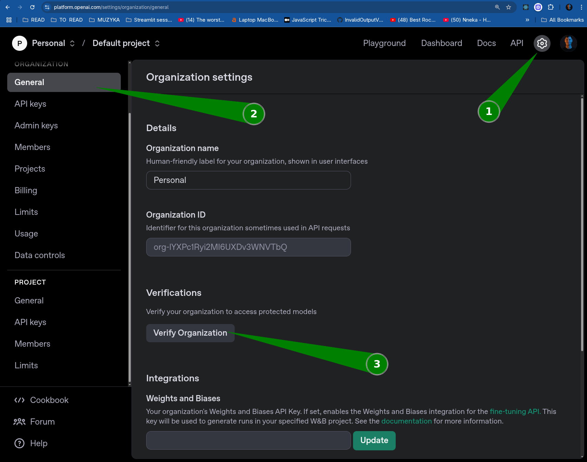

1. Następnie należy kliknąć w `Verify Organization`
   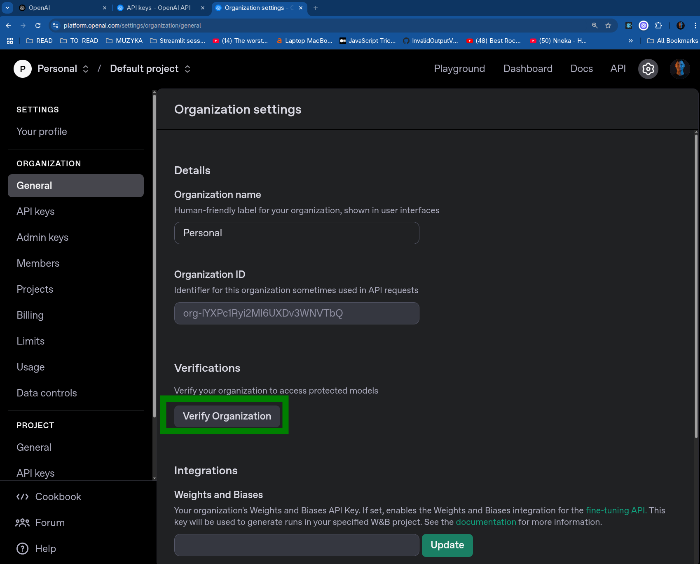

1. Następnie należy kliknąć w `Start ID Check` i podążać za dalszymi instrukcjami.
   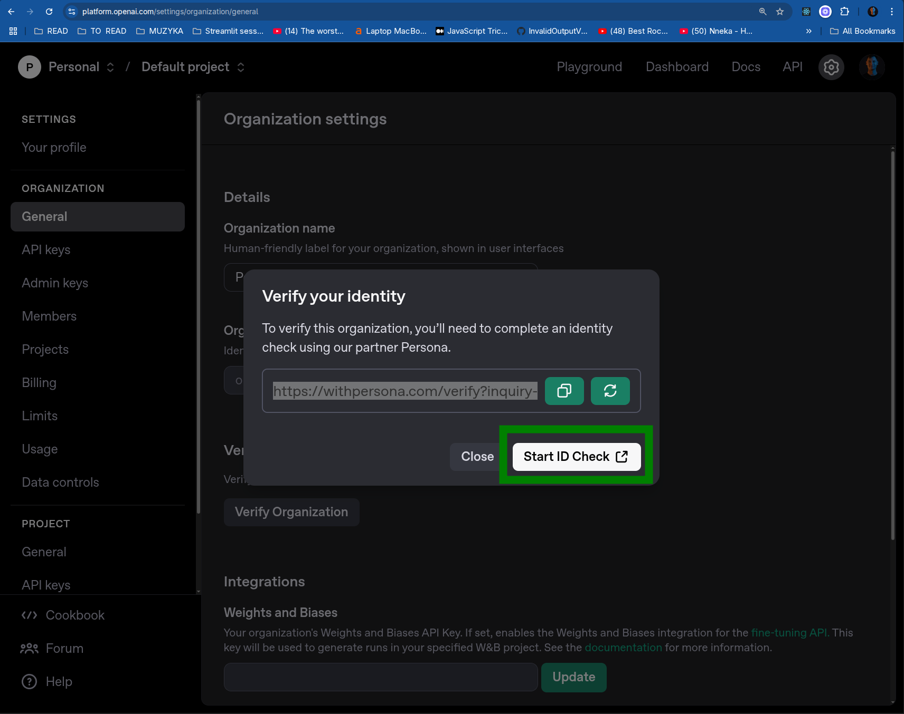

1. Po zweryfikowaniu naszej tożsamości, możemy ponownie spróbować wygenerować zdjęcie.
   Tak wygląda strona po zweryfikowaniu naszej tożsamości
   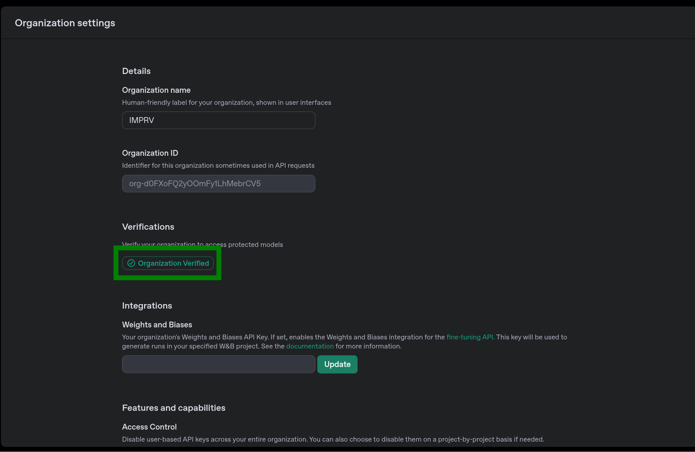

## **Workflow nie działa - błąd "Bad request - please check your parameters"**

1. Jeśli podczas wykonywania workflow widzisz błąd `Bad request - please check your parameters` w node'zie z polską nazwą:
   
      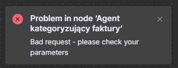

1. W sekcji `Output` zobaczysz szczegółowy błąd informujący o nieprawidłowej nazwie funkcji, która nie pasuje do wzorca `^[a-zA-Z0-9_-]+$`
   
      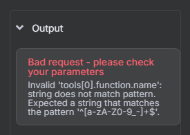

1. Problem występuje w node'ach z polskimi znakami w nazwie (ą, ć, ę, ł, ń, ó, ś, ź, ż), które nie są dozwolone w niektórych kontekstach API
      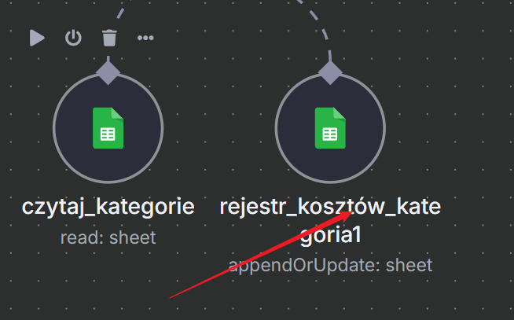

### **Rozwiązanie:**

1. **Zmień nazwę node'a** na angielską lub usuń polskie znaki:
      - zamiast "Agent kategoryzujący faktury" użyj "Agent_kategoryzujacy_faktury" lub "Invoice_Categorizer"
      - zamiast "rejestr_kosztów_kategoria1" użyj "rejestr_kosztow_kategoria1" lub "cost_register_category1"

1. **Kliknij dwukrotnie** na problematyczny node, aby otworzyć jego ustawienia

1. **W górnej części** znajdź pole z nazwą node'a i zmień ją na wersję bez polskich znaków

1. **Zapisz zmiany** i uruchom workflow ponownie

### **Dozwolone znaki w nazwach node'ów:**
- Litery angielskie: `a-z`, `A-Z`
- Cyfry: `0-9`
- Podkreślnik: `_`
- Myślnik: `-`

### **Niedozwolone znaki:**
- Polskie znaki diakrytyczne: `ą`, `ć`, `ę`, `ł`, `ń`, `ó`, `ś`, `ź`, `ż`
- Spacje (użyj podkreślnika zamiast spacji)
- Znaki specjalne: `@`, `#`, `$`, `%`, `&`, `*`, `(`, `)`, `+`, `=`, itp.