---
tags:
  - Workflow
  - Node
  - Local File Trigger 
---

# **Rozwiązania problemów z workflowami z lekcji**

## **Workflow z czytaniem lokalnych plików nie działa - Local Files Trigger nie reaguje**

1. Jeśli pracujesz na systemie Windows i masz podpięty prawidłowo wolumen do folderu `pliki_n8n`, a Local Files Trigger nie reaguje
   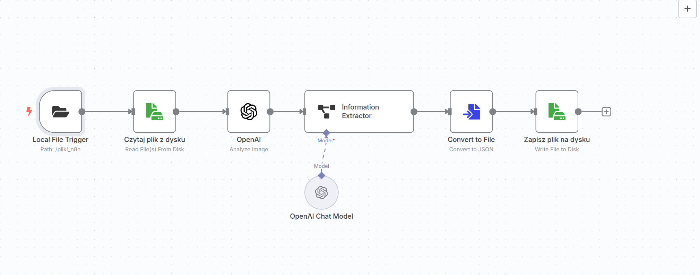

1. Kliknij dwukrotnie w node `Local File Trigger`
   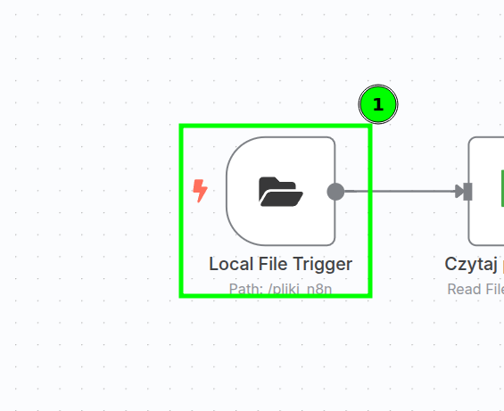

1. Kliknij w `Add Option`
   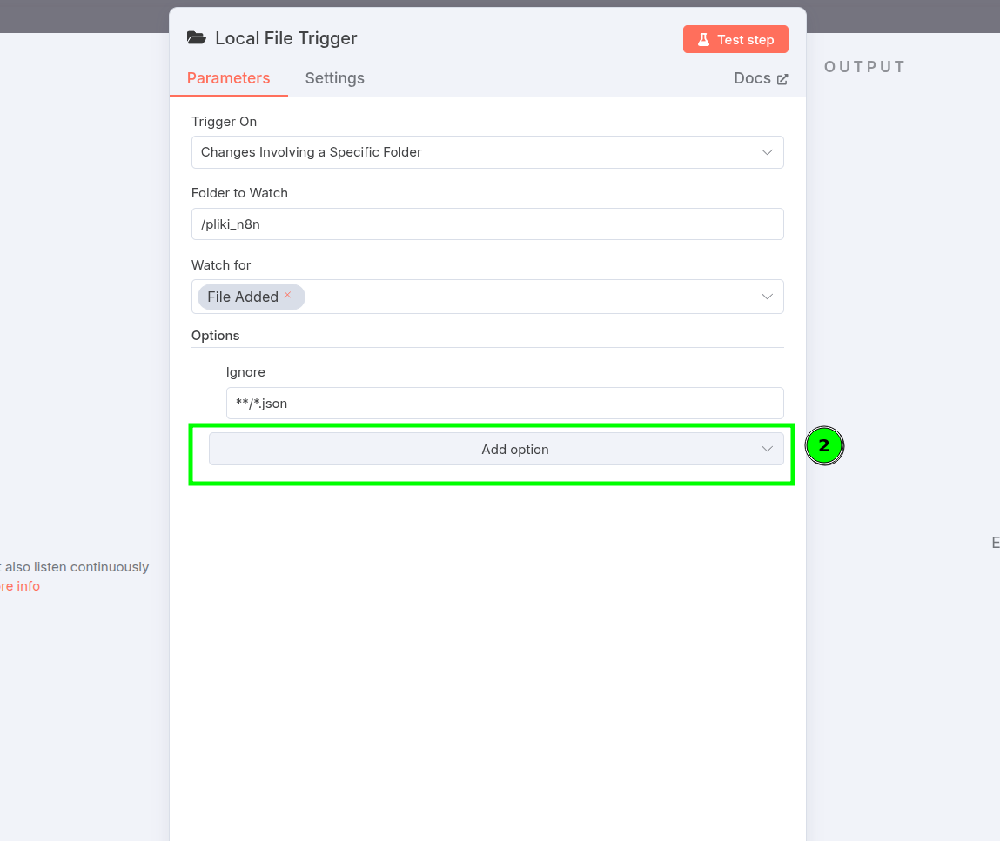

1. Z listy wybierz `Use Polling`
   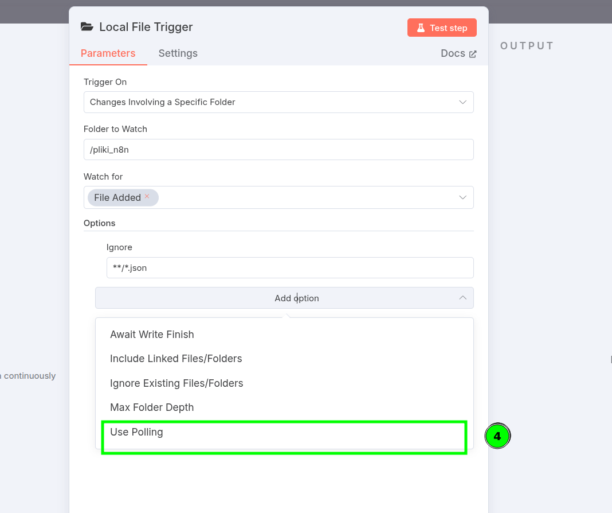

1. Kliknij w suwak tak, żeby się zaświecił na zielono
   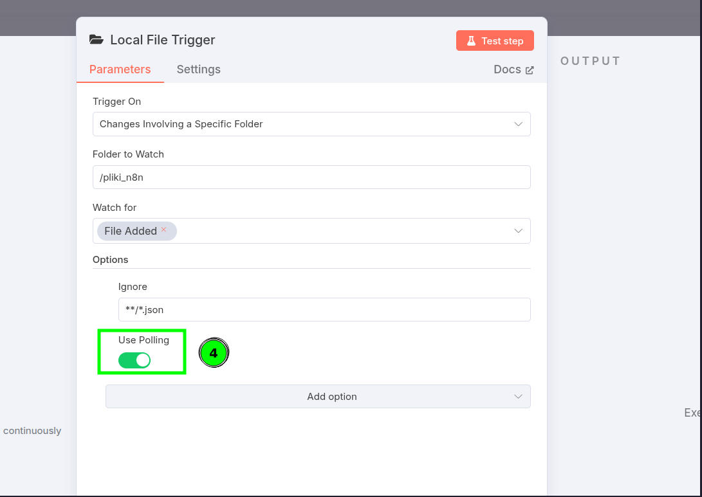

1. Powtórz test, przenosząc plik ze zdjęciem do folderu, i teraz powinno działać
    

    <iframe width="1280" height="720" src="https://www.youtube.com/embed/VNyzU-CtOAw?si=xKw39F_Wl0PNxz4-" title="YouTube video player" frameborder="0" allow="accelerometer; autoplay; clipboard-write; encrypted-media; gyroscope; picture-in-picture; web-share" referrerpolicy="strict-origin-when-cross-origin" allowfullscreen></iframe>
    

1. Jeśli wciąż nie działa, **usuń kontener** i spróbuj ponownie, uważając podczas **ustawiania katalogów**.
   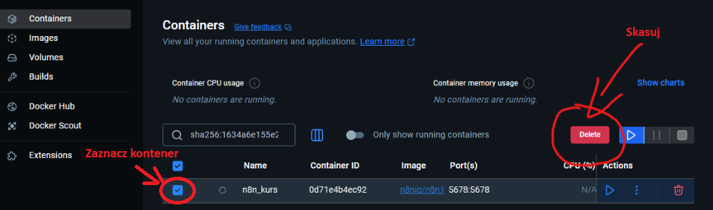

1. Po usunięciu kontenera przejdź do obrazów `Images` i uruchom obraz trójkątnym przyciskiem `Run`
   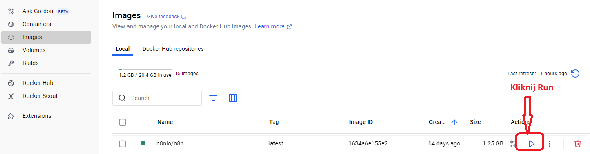

1. Pokaże się okno `Run a new container`, rozwiń zakładkę `Optional settings` i wypełnij wszystkie pola zgodnie ze schematem:
      - najpierw dodaj jako **pierwszy wolumen** ten, który już istniał (pod tymi samymi ścieżkami co wcześniej)
      - jako **drugi wolumen** podepnij ten nowy folder na dodawanie plików
      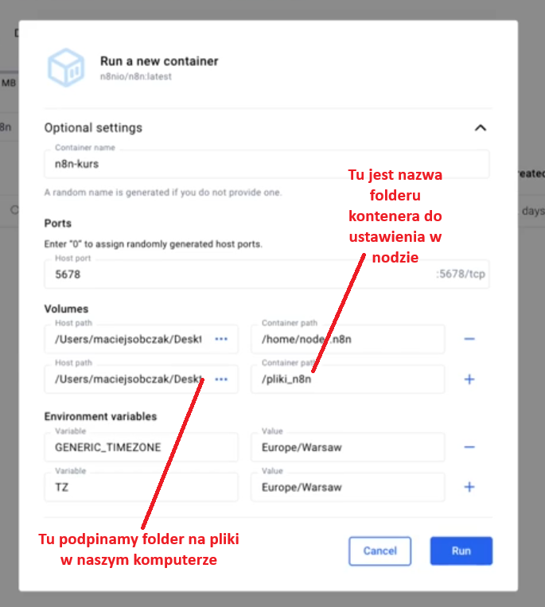

1. Aby sprawdzić, czy wszystko zrobiliśmy dobrze, w zakładce `Containers` kliknij na nazwę kontenera, a następnie w zakładkę `Bind mounts`:
   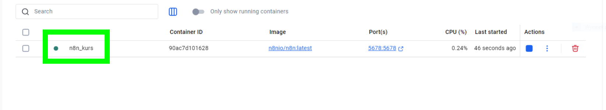
1. Tutaj powinny być widoczne dwa foldery. Pierwszy na dane n8n, a drugi do przekazywania plików do workflow. 
   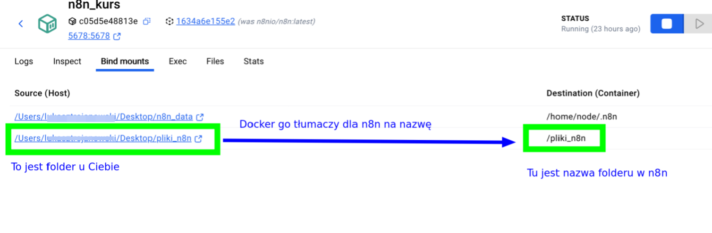

## **Workflow z modułu Agentka Elżbieta - nie widzę opcji w nodzie GMAIL**

1. Klikam w node Gmail i nie widzę opcji, które pokazane były na lekcji
   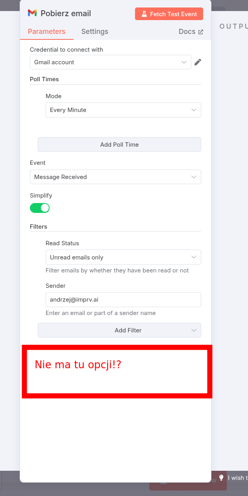

1. Żeby naprawić ten problem, należy odznaczyć `Simplify` (tak, żeby było nieaktywne i nie świeciło się na zielono)
   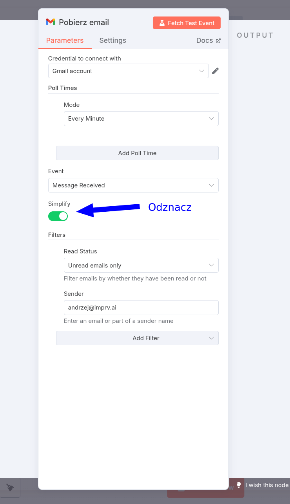

1. Po deaktywacji `Simplify` będziemy mogli dodać opcje (np. `Download attachments`)
   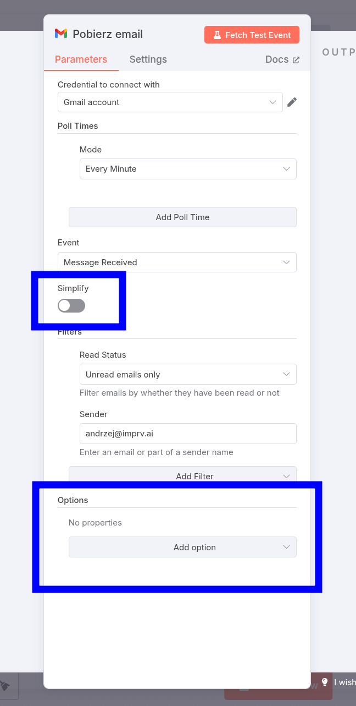

## **Workflow z modułu Agentka Elżbieta - nie widzę zakładki Binary w nodzie GMAIL po pobraniu danych**

1. Po pobraniu testowego maila z załącznikami nie widzę zakładki `Binary` w sekcji `Output`
   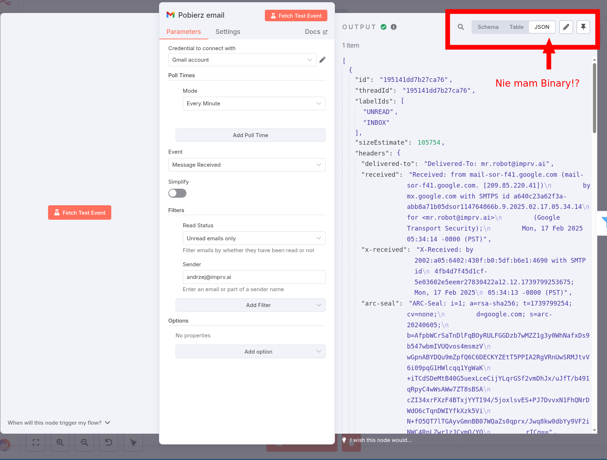

1. Zakładka Binary widoczna jest jedynie w sytuacji, gdy pobrane zostaną pliki. Node nie pobierze plików, jeżeli nie zaznaczymy opcji `Download attachments`. Należy zatem zaznaczyć tę opcję i ponownie pobrać dane.
   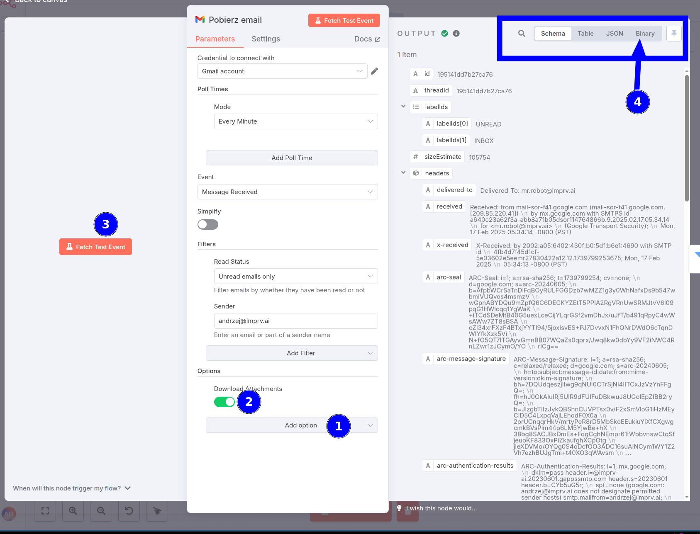