---
tags:
  - Moduł 3
  - Telegram
  - bot
  - chat not found
  - Workflow
---

# **Rozwiązania problemów z połączeniem n8n z Telegramem**

## **Połączenie workflow z botem w Telegramie nie działa**

1. Na stronie Telegrama w adresie www przeglądarki jest numer, który potrzebujemy jako Chat ID.
   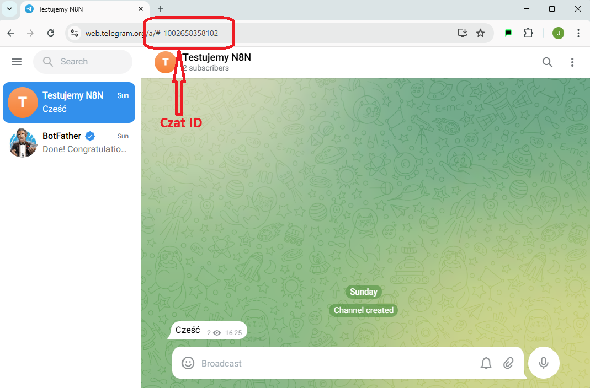
1. Są przypadki, że ten numer nie ma na początku `-100`. Wtedy do skopiowanego numeru należy taki początek dodać ręcznie.
   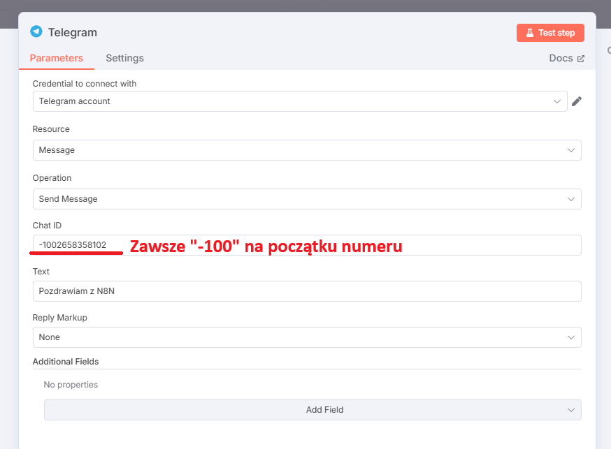

## **Trigger do nasłuchiwania na wiadomości z Telegrama zgłasza błąd**

1. Uruchamiam workflow, w którym mam node nasłuchujący na Telegram i mam taki błąd
   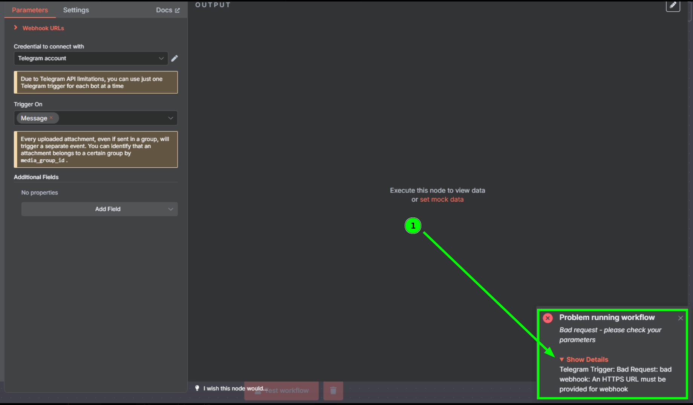

1. Należy ustawić zmienną środowiskową `WEBHOOK_URL` i jej wartość ustawić na domenę, którą mamy z `ngrok`

   **WAŻNE!** : wartość którą wpisujemy powinna mieć postać `https://TWOJA_DOMENA_NGROK`
   
<iframe src="https://www.loom.com/embed/b0fb4aa94f90493da164214e88ee1c07?sid=e86d29a8-2a97-4b11-840f-2bea0575d1a5" frameborder="0" webkitallowfullscreen mozallowfullscreen allowfullscreen style="position: absolute; top: 0; left: 0; width: 100%; height: 100%;"></iframe>

## **Trigger do nasłuchiwania na wiadomości z Telegrama nie reaguje**
1. Uruchamiam workflow z `Triggerem Telegrama`. Trigger się kręci i nie reaguje na moje wiadomości

1. W pierwszej kolejności sprawdź czy masz poprawnie ustawiony `WEBHOOK_URL` w zmiennych środowiskowych. Możesz to sprawdzić w zakładce `Env` w ustawieniach kontenera `n8n`. Instrukcja jak to zrobić znajduje się tutaj. [Kliknij](../02_docker_desktop/#jak-sprawdzic-ustawienia-kontenera-docker-desktop)

Należy tam szukać linijki `WEBHOOK_URL=https://twoja-domena-z-ngrok.free.app`. **To bardzo ważne żeby na początku było `https://`**
   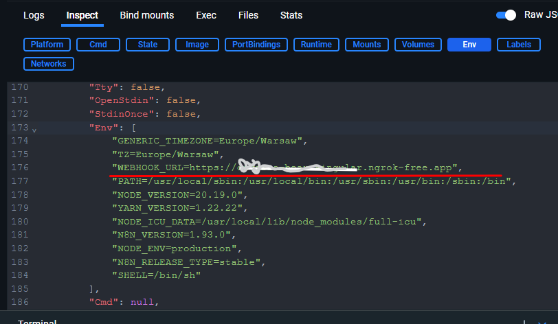

1. Jeśli masz tam taką wartość, to sprawdź czy Twój kontener `ngrok` jest prawidłowo uruchomiony
W tym celu otwórz stronę `localhost:4040/status`. Jest to strona kontenera `ngrok` uruchomionego na Twoim komputerze.

1. Jeśli strona się nie wyświetla. To znaczy, że kontener ngrok nie jest uruchomiony i należy go uruchomić
   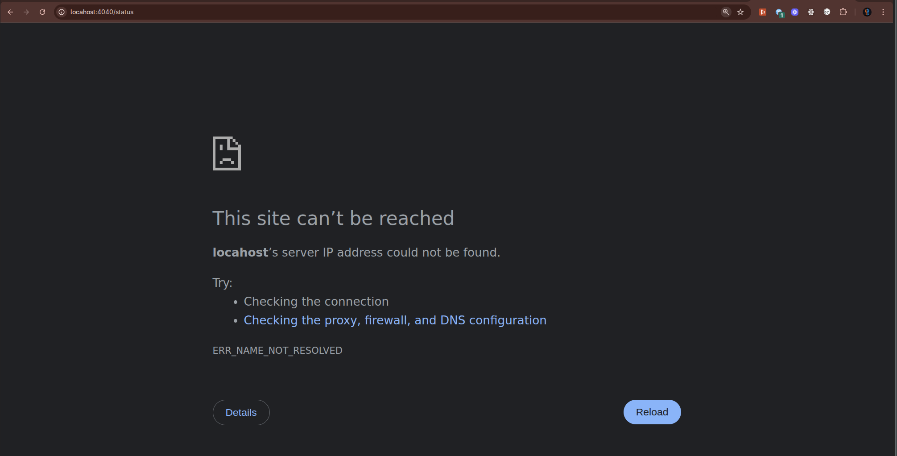

1. Jeśli `ngrok` jest prawidłowo uruchomiony to zobaczysz stronę statusu
   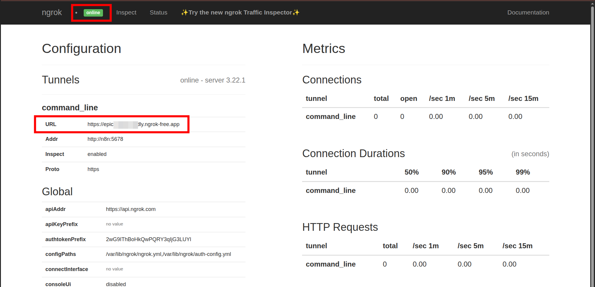
   Porównaj jeszcze raz wartość pola `URL` z tym co masz w `WEBHOOK_URL`

## **Przesyłanie zdjęcia przez Telegram do agenta nie działa. Zatrzymuje się na node SWITCH**

1. Kiedy wysyłam zdjęcie, node SWITCH pokazuje taki problem
   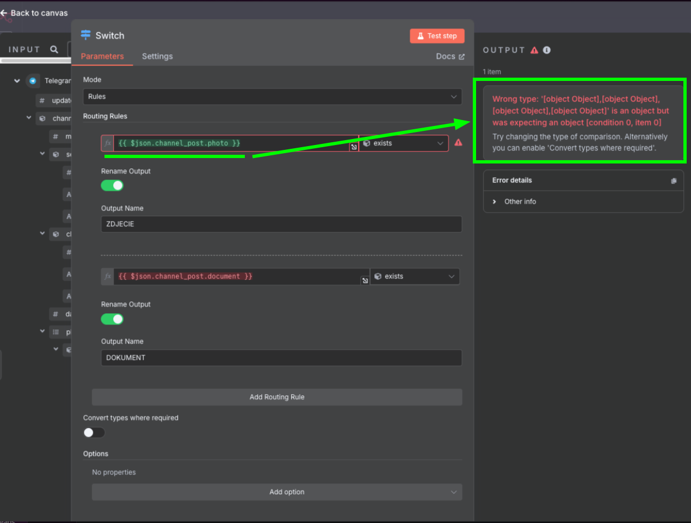

1. Zwróć uwagę, żeby w `Routing Rules` w typie porównania wybrać `Array`, a następnie `exists`
   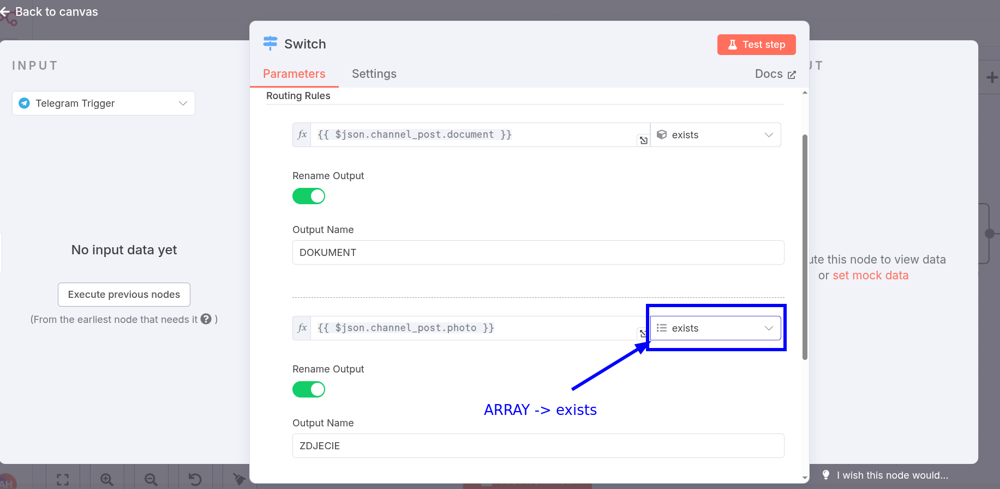
   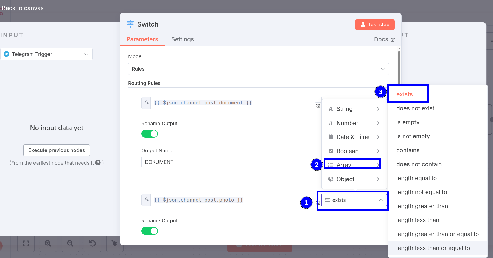

## **Przesyłanie zdjęcia przez Telegram do agenta nie działa. Zatrzymuje się na node Telegram Get File**
   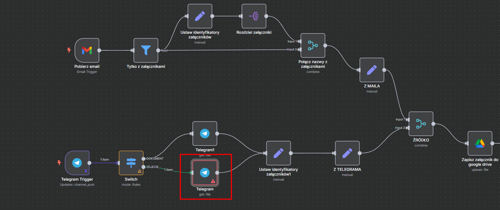
   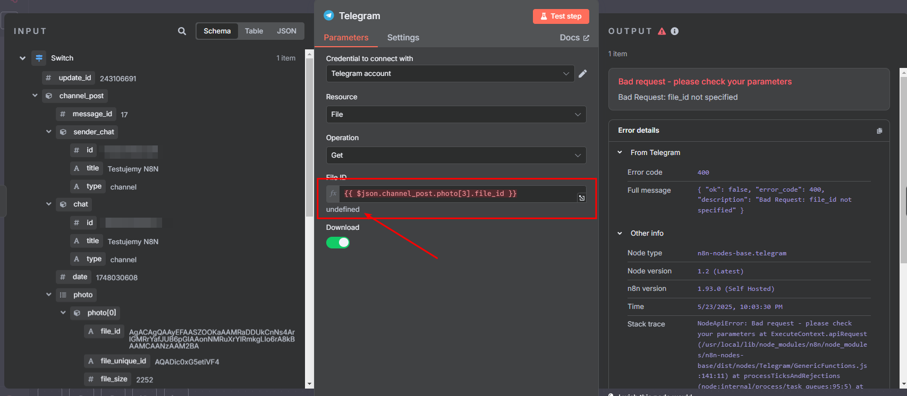

1. Tak się dzieje dlatego, że w zależności od tego jakiej jakości zdjęcie wyślemy, tyle "kopii" zdjęcia przesyła nam telegram w danej wiadomości.
Jeśli przesyłamy zdjęcie słabej jakości to otrzymamy do 2 elementów
Jeśli przesyłamy zdjęcie wysokiej jakości to otrzymamy od 3 elementów
Wartość 3 została zaproponowana w lekcji dlatego, że dla dużych zdjęć ta jakość jest wystarczająco dobra żeby uzyskać satysfakcjonujące efekty.

1. Żeby wrokflow zawsze brał zdjęcie najwyższej jakości, niezależnie od rozmiaru zdjęcia przesłanego przez telegram
**należy zmienić wartość w polu `File ID` na `{{ $json.channel_post.photo.last().file_id }}`**

## **Wersja Web K kontra Web A**

Telegram oferuje dwie totalnie niezależne wersje swojej aplikacji webowej (czyli tej którą uruchamiamy w przeglądarce).

Wersje te różnią się pod pewnymi względami. Rekomendujemy użycie tzw. wersji `Web A` dostępnej pod adresem [https://web.telegram.org/a/](https://web.telegram.org/a/)

> UWAGA: Wpisanie w przegladarke [https://web.telegram.org](https://web.telegram.org) pozwoli telegramowi lub / i przeglądarce na wybranie wersji. Wówczas wasza przeglądarka może wymuszać cały czas wersję `/k`. Dopiero wskazanie na [https://web.telegram.org/a](https://web.telegram.org/a) przekierowuje na wersję `Web A`.

Wersja `Web A` jest wolna od wielu problemów, zwłaszcza w zarządaniu botami i administratorami.

Dodatkowo wszystkie nasze lekcje dotyczące Telegrama są stworzone w oparciu o wersję `Web A`.

Jeżeli nie wiesz na jakiej wersji pracujesz, to możesz to sprawdzić w adresie URL w przeglądarce, albo:

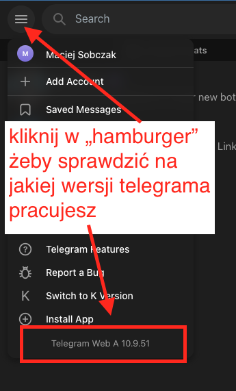

## **Pojawia się błąd Bad Reguest: chat not found**

   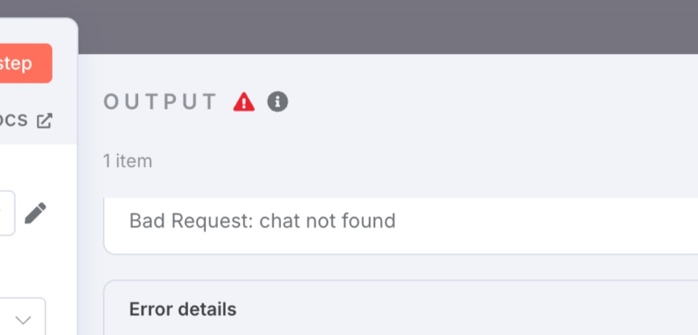
   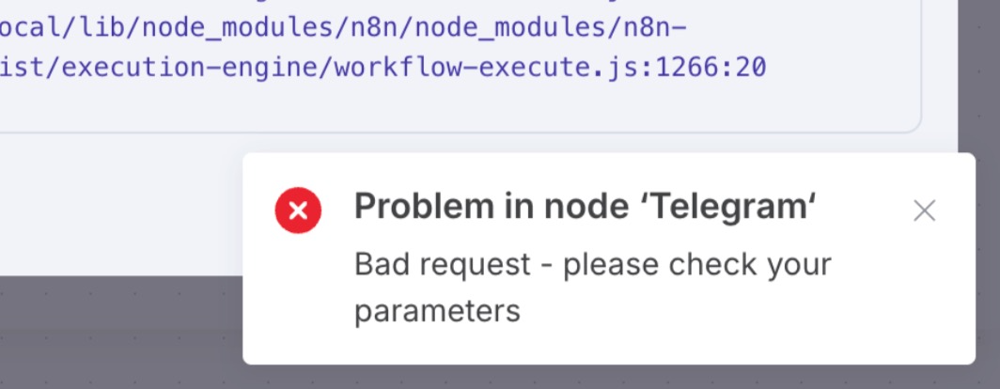

Jeśli nawet po sprawdzeniu poprawności `Chat ID` i `tokena` błąd nadal występuje, to być może mamy podłączonego jakiegoś obcego lub niepoprawnego bota jako administratora naszego czata.

1. Należy uważać już w momencie wyszukiwania `BotFather`. Najlepiej wpisz pełną nazwę i wybierz tylko bota, który:
      - ma dokładnie taką nazwę,
      - jest oznaczony jako oficjalny bot Telegrama (znaczek w kółku),
      - posiada dużą liczbę użytkowników – w chwili tworzenia tego obrazka było to ponad 3,5 miliona użytkowników.
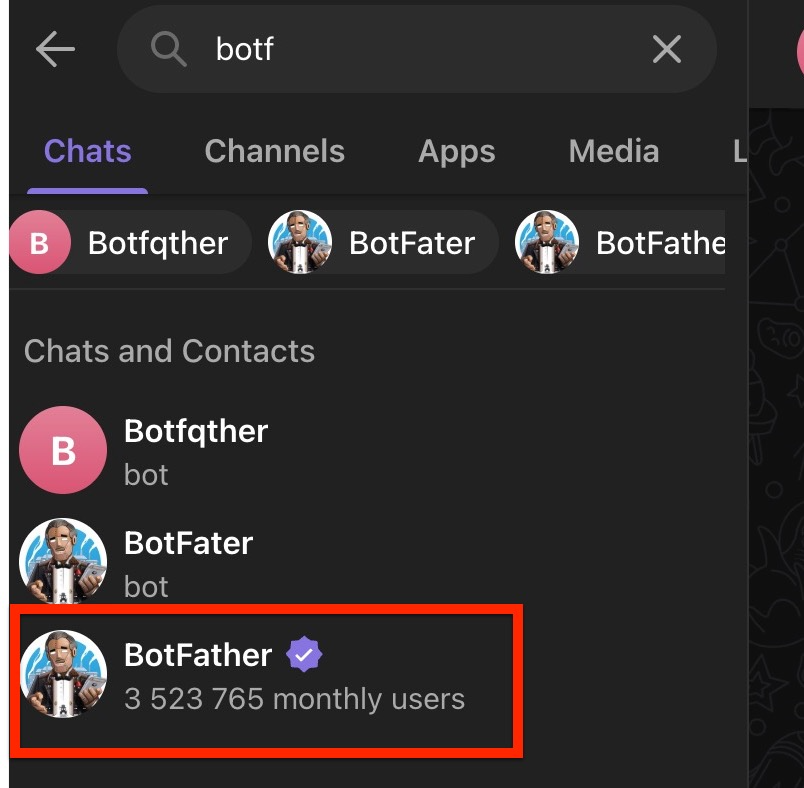

1. Trzeba zapisać lub zapamiętać dokładny `username` tworzonego bota - on jest unikatowy dla całego Telegrama i według tej nazwy będziemy potem przypinać bota jako administratora do naszego kanału w Telegramie.
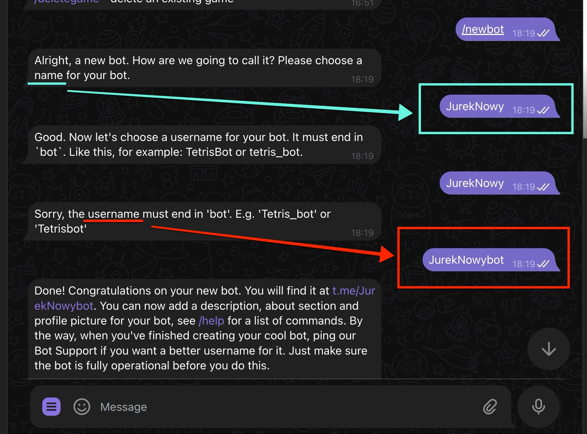

1. Podczas podłączania bota jako administratora do naszego kanału należy zachować ostrożność i wpisywać do wyszukiwarki pełny `@username` naszego bota.
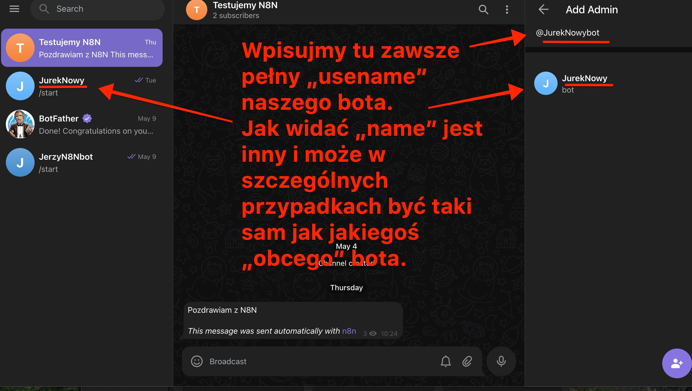

Po dodaniu bota w powyższy sposób i podłączeniu go do naszego czata oraz po ponownym uzupełnieniu `Chat ID` i `tokena` w n8n workflow powinien działać i nie zgłaszać błędu `chat not found`.