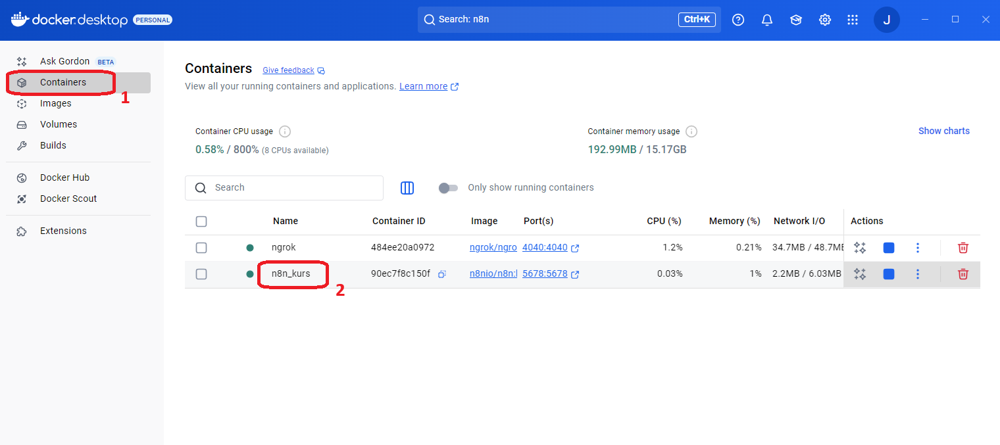
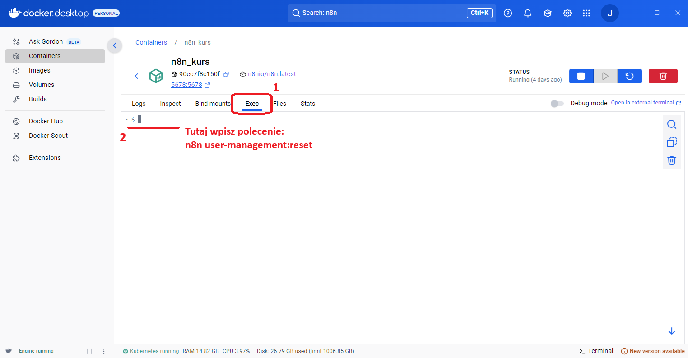
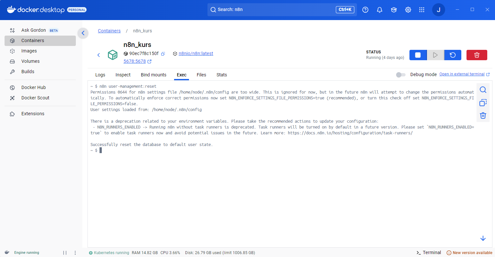
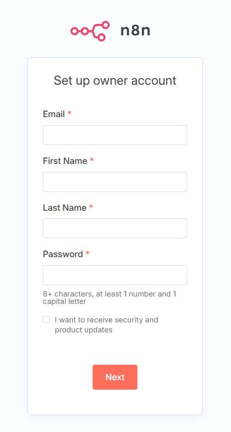
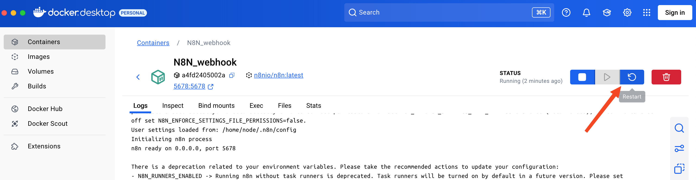

---
tags:
  - Moduł 3
  - n8n
  - Logowanie
  - Hasło
---

# **Rozwiązania problemów z loginem i hasłem do n8n**

## **Resetowanie loginu i hasła do lokalnego n8n**

1. Jeśli nie możesz zalogować się do swojej aplikacji **n8n** z powodu nieprawidłowego loginu lub hasła, to należy te dane zresetować. 
W pierwszej kolejności przejdź do **Docker Desktop** i na stronie **Containers** kliknij w nazwę swojego kontenera **n8n**. 
   
      

1. Następnie przejdź do zakładki **Exec** i w oknie terminala wpisz polecenie 
`n8n user-management:reset` i naciśnij `Enter`. 
Polecenie można wkleić za pomocą kliknięcia prawym klawiszem myszy i wybrania `Paste`.

      

1. Jeśli zresetowanie loginu i hasła powiedzie się powinieneś otrzymać komunikat podobny do tego:

      

1. Przejdź wtedy na stronę swojej aplikacji n8n `http://localhost:5678`. Powinnien pokazać się formularz do ustawiania loginu i hasła. Można wpisać dowolne dane - takie jak były poprzednio, ale też zupełnie nowe. 
Po zalogowaniu będą dostępne te same workflowy i credentiale. 

      

1. Jeśli po którymkolwiek kroku nie zobaczysz oczekiwanego wyniku, tak jak opisano w powyższych krokach, zrestartuj proszę kontener, na którym pracujesz. Reset kontenera w większości przypadków pozwoli odświeżyć środowisko pracy i umożliwi wykonanie opisanych wyżej instrukcji.
Możesz to zrobić bezpośrednio z poziomu **Docker Desktop**.

      