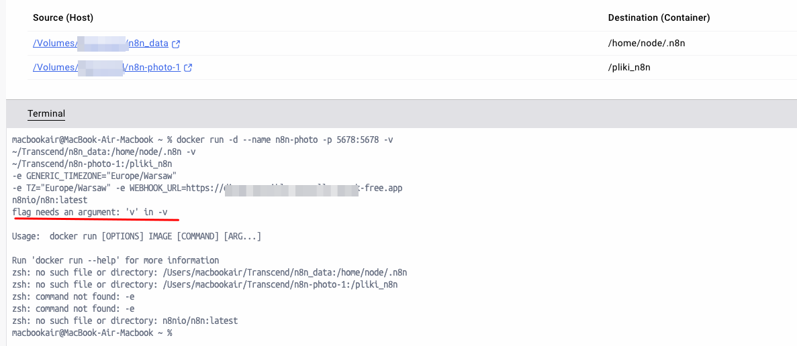

---
tags:
  - Moduł 3
  - ngrok
  - docker
  - domena ngrok
  - ngrok resetuje
---

# **Rozwiązania problemów z ngrok**

## **Nie wiem jaką mam domenę w ngrok**

1. Żeby znaleźć naszą domenę ngrok należy zalogować się na stronę [ngrok](https://dashboard.ngrok.com/) i przejść do zakładki [domains](https://dashboard.ngrok.com/domains)
    

## **Ngrok mi nie działa**
1. Po wejściu na domenę ngrok widzę następującą stronę
    

1. W takiej sytuacji upewnij się, że masz uruchomiony kontener `ngrok` w Docker Desktop
1. Jeśli nie masz uruchomionego kontenera `ngrok`, to uruchom go, a następnie odśwież stronę

## **Kontener ngrok mi się uruchamia i potem się zatrzymuje (resetuje się) w Docker Desktop**
1. W takiej sytuacji sprawdź `logi` kontenera, czyli informacje, które raportuje podczas działania
1. Wpisz w terminalu `docker logs ngrok` i przeczytaj, czy ngrok zgłasza jakiś problem. Wklej ten komunikat do ChatGPT i postaraj się zrozumieć, co może być problemem. W razie trudności opisz problem na Discord i załącz logi

## **Uruchamiam ngrok i wyskakuje mi taki błąd - the container name "/ngrok" is already used**


1. Błąd ten oznacza, że masz już uruchomiony kontener o nazwie `ngrok`
1. Żeby wyświetlić wszystkie kontenery otwórz Docker Desktop lub wpisz w terminal i potwierdź enterem:
```
docker ps -a
```
1. Żeby pozbyć się błędu usuń istniejący kontener ngrok. Możesz to zrobić komendą:
```
docker rm -f ngrok
```
1. Następnie, żeby uruchomić nowy kontener, wywołaj poniższą komendę w terminalu. Pamiętaj, żeby podmienić `TWOJ_TOKEN_AUTENTYKACYJNY_NGROK` i `TWOJA_DOMENA_W_NGROK`
```
docker run -it -d --name ngrok -p 4040:4040 -e NGROK_AUTHTOKEN=TWOJ_TOKEN_AUTENTYKACYJNY_NGROK ngrok/ngrok:latest http host.docker.internal:5678 --domain=TWOJA_DOMENA_W_NGROK
```
## **Uruchamiam ngrok i wyskakuje mi błąd - pojawiają się dziwne znaczki i minusy**
**Taki**

**lub taki**
```
PS C:\Users\zminda> docker run -it -d --name ngrok \
>> -p 4040:4040 -e \
>> NGROK_AUTHTOKEN= 00000000000000000 \
>> ngrok/ngrok:latest \
>> http host.docker.internal:5678 \
>> --domain= lark-sdfsdfsd-snake.ngrok-free.app
>>
At line:6 char:3
+ --domain= lark-sdfsdsfds-snake.ngrok-free.app
+   ~
Missing expression after unary operator '--'.
At line:6 char:3
+ --domain= lark-sdfsdfsd-snake.ngrok-free.app
+   ~~~
Unexpected token 'domain=' in expression or statement.
    + CategoryInfo          : ParserError: (:) [], ParentContainsErrorRecordException
    + FullyQualifiedErrorId : MissingExpressionAfterOperator
```

1. Zazwyczaj oznacza to błąd w formatowaniu komendy. Uruchom poniższą komendę pamiętając, żeby podmienić `TWOJ_TOKEN_AUTENTYKACYJNY_NGROK` i `TWOJA_DOMENA_W_NGROK`. **Nie dawaj spacji przed ani po znaku =**

```
docker run -it -d --name ngrok -p 4040:4040 -e NGROK_AUTHTOKEN=TWOJ_TOKEN_AUTENTYKACYJNY_NGROK ngrok/ngrok:latest http host.docker.internal:5678 --domain=TWOJA_DOMENA_W_NGROK
```

## Niepoprawny token autentykacyjny

1. Jeśli wyskakuje błąd `authentication failed: The authtoken you specified does not look like a proper ngrok tunnel authtoken` to oznacza, że token autentykacyjny jest niepoprawny.


1. PAMIĘTAJ! Wpisz "goły" token autentykacyjny, bez ekstra spacji lub dodawania `<` lub `>`. Przykładowa instrukcja dla token `123secret123secret123secret123` oraz domeny `moj-dostepny-do-uzycia-w-ngrok.ngrok-free.app`:
```bash
docker run -it -d --name ngrok -p 4040:4040 -e NGROK_AUTHTOKEN=123secret123secret123secret123 ngrok/ngrok:latest http host.docker.internal:5678 --domain=moj-dostepny-do-uzycia-w-ngrok.ngrok-free.app
```

## **Przekroczono limit zapytań HTTP w ngrok (ERR_NGROK_727)**

1. Jeśli po wejściu na swoją domenę widzisz komunikat jak poniżej, oznacza to, że Twoje konto przekroczyło dopuszczalną liczbę zapytań HTTP w bieżącym okresie rozliczeniowym:
    

2. Wejdź na [dashboard ngrok](https://dashboard.ngrok.com/) i przejdź do zakładki `Usage`, aby potwierdzić przekroczenie limitów. Zwróć uwagę na pozycję `HTTPS Endpoint Requests` oraz `TCP Connection Rate Limit`:
    

### Co to oznacza?

- Limit zapytań zależy od planu. W planie darmowym można go przekroczyć podczas testów lub gdy z aplikacji korzysta wielu użytkowników/botów.


### Prawdopodobna przyczyna
Po uruchomieniu kontenera z ngrok, przechwytuje on również anonimowy ruch diagnostyczny przesyłany do n8n.

### Jak to naprawić?

Pomocne jest wyłączenie wysyłania anonimowego ruchu diagnostycznego do n8n.
Żeby to zrobić należy ustawić zmienną środowiskową `N8N_DIAGNOSTICS_ENABLED` na wartość `false`.

Źródła:
- [Dokumentacja n8n](https://docs.n8n.io/hosting/securing/telemetry-opt-out/#data-collection)

**Kroki:**

1. Usuń istniejący kontener n8n z Docker Desktop
1. Uruchom nowy kontener n8n z **dodatkową** zmienną środowiskową `N8N_DIAGNOSTICS_ENABLED` ustawioną na `false`

    !!! tip
        **Podpowiedź**  
        Jeśli nie pamiętasz jak tworzyć kontener n8n od zera wróć do lekcji [Uruchamiamy n8n z Docker Desktop](https://app.imprv.ai/assignments?taskEntityId=c780f2e3-7b9d-44e6-8923-762730eefa87)

        **LUB**

        Zerknij na ten przykład z `WEBHOOK_URL`
        <div style="position: relative; padding-bottom: 56.25%; height: 0;"><iframe src="https://www.loom.com/embed/b0fb4aa94f90493da164214e88ee1c07?sid=e86d29a8-2a97-4b11-840f-2bea0575d1a5" frameborder="0" webkitallowfullscreen mozallowfullscreen allowfullscreen style="position: absolute; top: 0; left: 0; width: 100%; height: 100%;"></iframe></div>


### Co jeśli już przekroczyłam/łem limit?
- **Utwórz nowe darmowe konto ngrok**: Jeśli osiągnięty limit blokuje dalszą naukę, rozważ utworzenie nowego darmowego konta ngrok na inny adres email. Pamiętaj o ustawieniu zmiennej środowiskowej `N8N_DIAGNOSTICS_ENABLED` na `false`, żeby problem się nie powtórzył.

- **Zaczekaj na reset limitu**: Wstrzymaj ruch do tunelu (czyli zamknij publiczne udostępnienia - kontener ngrok) i poczekaj do resetu limitu w kolejnym cyklu rozliczeniowym (widoczny w prawym górnym rogu strony `Usage` - zazwyczaj jest to kolejny miesiąc).