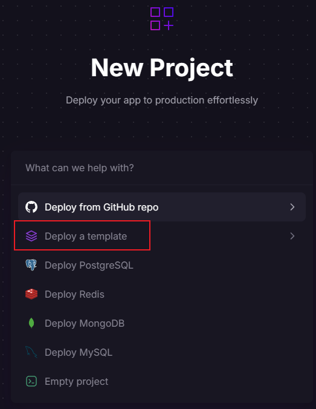
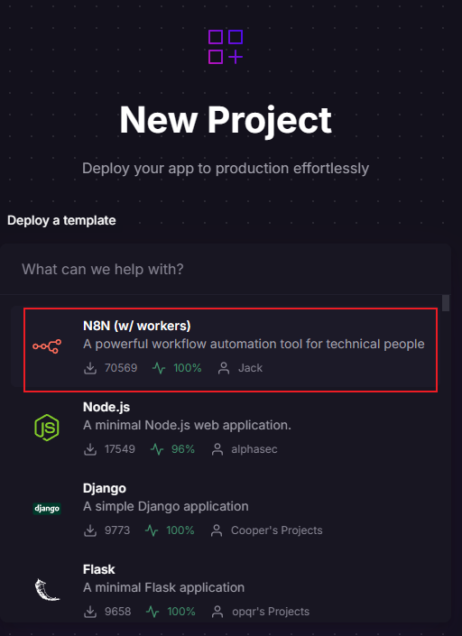
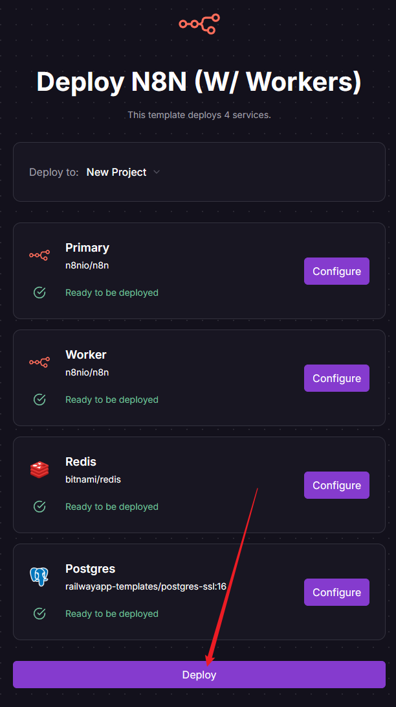

---
tags:
  - Moduł 5
  - railway
  - wdrazanie
  - deployment
  - subskrypcja railway
---

# **Wdrażanie N8N na zdalnym serwerze – dodatkowe informacje**

## **Moja karta płatnicza została odrzucona – Railway Hobby Plan**

1. Aby zasubskrybować Railway Hobby Plan, **należy podpiąć kartę kredytową lub debetową.**  
Próba dodania karty przedpłaconej pre-paid (np. z portfela internetowego Skrill) skutkuje pobraniem 1 USD w celu autoryzacji, a następnie odrzuceniem karty. Pobrana kwota zostanie później zwrócona.
   
      

## **Jak zmienić wersję n8n na Railway**
  
<iframe src="https://player.vimeo.com/video/1094347117?h=6acbaeb4c9&amp;badge=0&amp;autopause=0&amp;player_id=0&amp;app_id=58479" frameborder="0" allow="autoplay; fullscreen; picture-in-picture; clipboard-write; encrypted-media; web-share" style="position:absolute;top:0;left:0;width:100%;height:100%;" title="Zmiana wersji komponentów na Railway"></iframe>

## **Jak zmienić hasło do n8n na Railway**
  Będzie nam potrzebna komenda `n8n user-management:reset`, którą znamy z poradnika [Resetowanie loginu i hasła do lokalnego n8n](./08_reset_password_n8n.md#resetowanie-loginu-i-hasła-do-lokalnego-n8n)
  
  
<iframe src="https://player.vimeo.com/video/1097765709?h=83d65c8270&amp;badge=0&amp;autopause=0&amp;player_id=0&amp;app_id=58479" frameborder="0" allow="autoplay; fullscreen; picture-in-picture; clipboard-write; encrypted-media; web-share" style="position:absolute;top:0;left:0;width:100%;height:100%;" title="reset_hasla_n 8n_railway-2025-07-01_09.28.55"></iframe>

## **Zmienił się ekran startowy tworzenia nowego projektu w Railway**

Ostatnia aktualizacja Railway wprowadziła nowy wygląd ekranu „New Project”. Jeśli korzystasz z szablonu do uruchomienia `n8n` w Railway, teraz zobaczysz nieco inny układ kroków. Poniżej znajdziesz aktualny, poprawny przepływ z przykładami ekranów.

1. Na ekranie „New Project” wybierz opcję **Deploy a template**.
   

1. Na liście szablonów wybierz pozycję **N8N (w/ workers)**.
   

1. Na widoku „Deploy N8N (W/ Workers)” pozostaw domyślne ustawienia usług (`Primary`, `Worker`, `Redis`, `Postgres`) i kliknij przycisk **Deploy** na dole strony.
   

Po wdrożeniu Railway utworzy projekt z czterema usługami. Dalej postępuj zgodnie z instrukcjami konfiguracji środowiska z kursu.