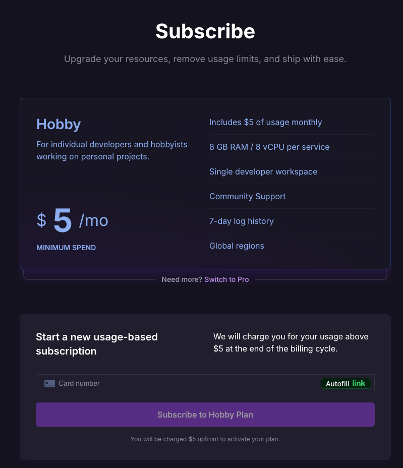

---
tags:
  - Moduł 5
  - railway
  - wdrazanie
  - deployment
  - subskrypcja railway
---

# **Wdrażanie N8N na zdalnym serwerze – dodatkowe informacje**

## **Moja karta płatnicza została odrzucona – Railway Hobby Plan**

1. Aby zasubskrybować Railway Hobby Plan, **należy podpiąć kartę kredytową lub debetową.**  
Próba dodania karty przedpłaconej pre-paid (np. z portfela internetowego Skrill) skutkuje pobraniem 1 USD w celu autoryzacji, a następnie odrzuceniem karty. Pobrana kwota zostanie później zwrócona.
   
      

## **Jak zmienić wersję n8n na Railway**
  
<iframe src="https://player.vimeo.com/video/1094347117?h=6acbaeb4c9&amp;badge=0&amp;autopause=0&amp;player_id=0&amp;app_id=58479" frameborder="0" allow="autoplay; fullscreen; picture-in-picture; clipboard-write; encrypted-media; web-share" style="position:absolute;top:0;left:0;width:100%;height:100%;" title="Zmiana wersji komponentów na Railway"></iframe>
