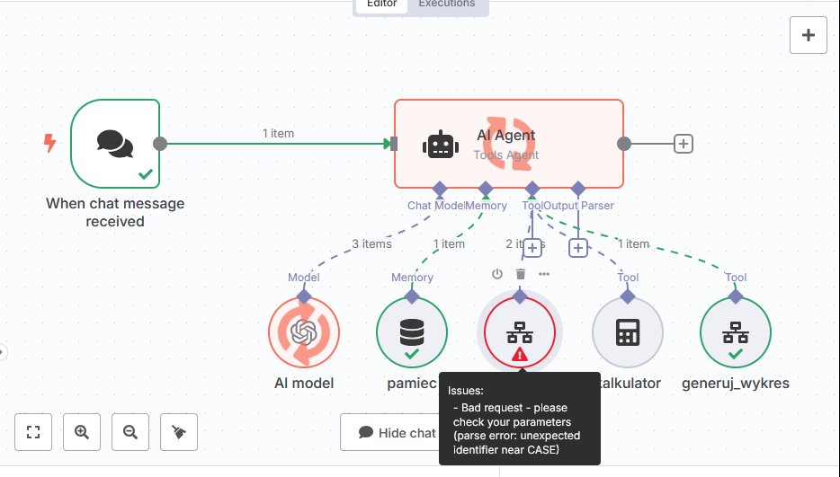

---
tags:
  - Moduł 4
  - wyszukiwanie SQL
  - generowanie wykresów
  - charts.js
---

# **Workflow do generowania wykresów i wyszukiwania danych - SQL**

## **Problem z przeszukiwaniem bazy danych z node *pobierz_dane* - parse error: unexpected identifier near CASE**

1. **W SeaTable zapytania SQL nie obsługują konstrukcji CASE**, co skutkuje błędem „parse error: unexpected identifier near CASE”. Jeśli kwerenda SQL zaproponowana przez node *pobierz_dane* będzie zawierała instrukcję CASE, w N8N pojawi się ten błąd. Można zastosować obejście i odpowiednio poinstruować prompt, by nie używał niewspieranej konstrukcji podczas generowania zapytania SQL. W takim przypadku należy poprawić prompt w polu description w node *pobierz_dane*, jeśli nazwy są identyczne jak na lekcji.

      
      
2. Jest też możliwe, że model sam zaproponuje poprawienie kwerendy SQL – wtedy możemy zgodzić się na powtórzenie operacji bezpośrednio w czacie.
      

## **Problem z generowaniem wykresu - brak danych**

1. Jeśli podczas próby wygenerowania wykresu, pomimo przekazania odpowiednich danych przez node *pobierz_dane*, **wykres stworzony przez node *wygeneruj_wykres* jest pusty**, możliwe, że występuje problem z poprawnym przekazaniem danych do tego node'a.

      

2. **Sprawdź w ustawieniach node *wygeneruj_wykres*, czy opcja workflow inputs jest ustawiona na - Defined automatically by the model.** W ten sposób upewniamy się, że model automatycznie sprawdzi i przekaże poprawne dane dla naszego workflow, dzięki czemu wykres zostanie wygenerowany na faktycznych danych.
      

## **Problem z generowaniem linku do wykresu - zmiana struktury Outputu w node Message a model**

1. Jeśli napotykasz błąd przy generowaniu linku do wykresu, może to wynikać ze zmiany struktury danych wyjściowych w node `Message a model`.

      

2. W ustawieniach node'a `generuj_text` znajdź pole, w którym budowany jest URL i podmień fragment kodu odpowiedzialny za pobranie treści na:
   ```
   $json.output[0].content[0].text.trim().base64Encode()
   ```
   
      

3. Zastosuj zmiany w **obu** node'ach odpowiedzialnych za generowanie tekstu (tj. `generuj_text`, `generuj_link_do_wykresu`) – zarówno dla **Test Output**, jak i **Production Output**.

      
