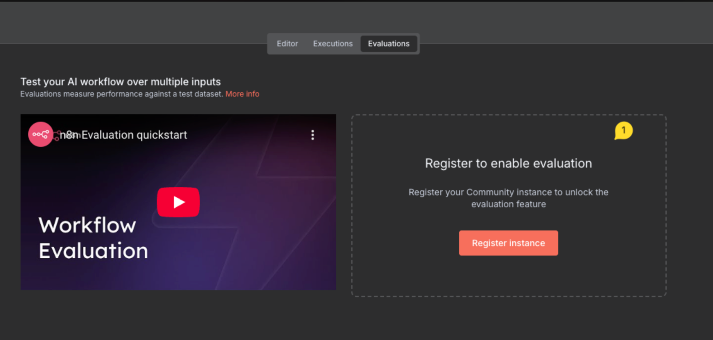
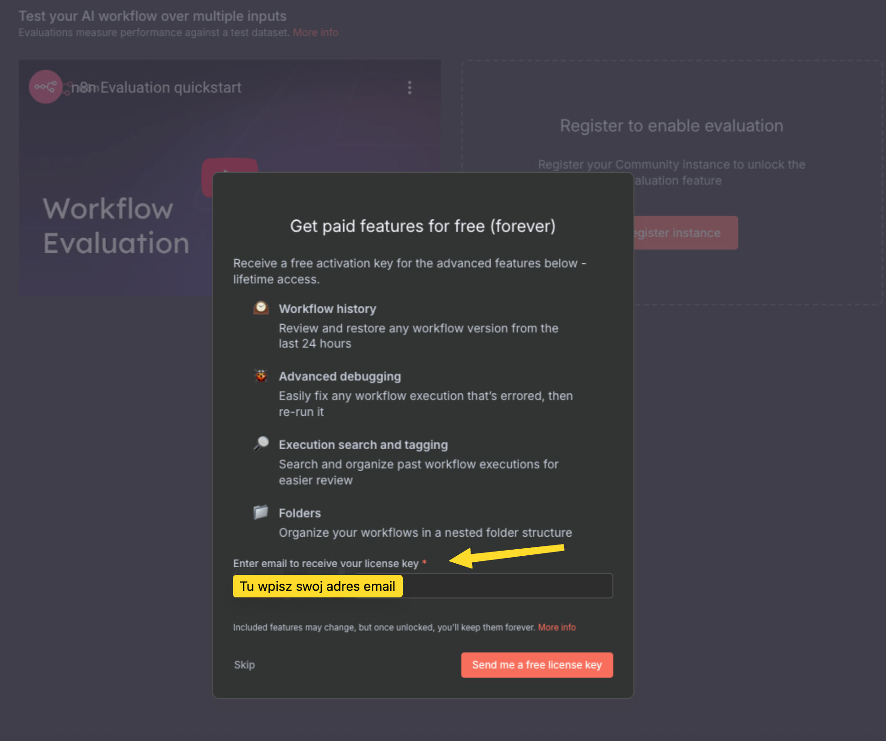
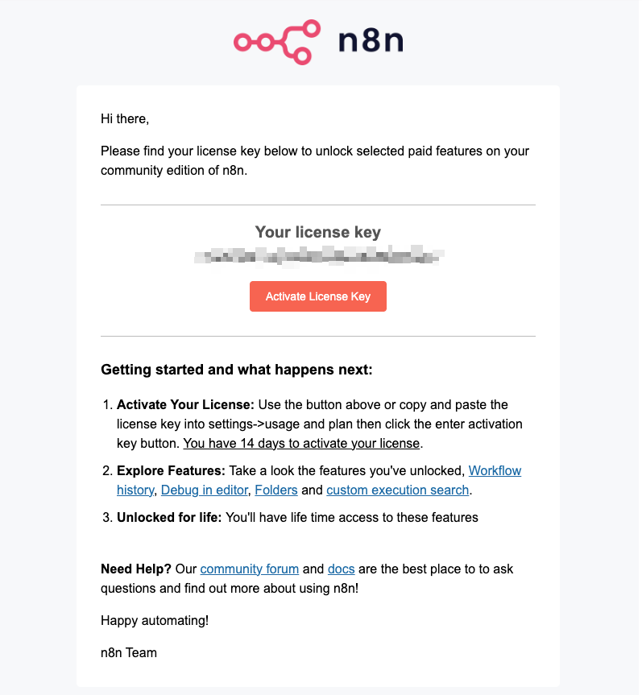
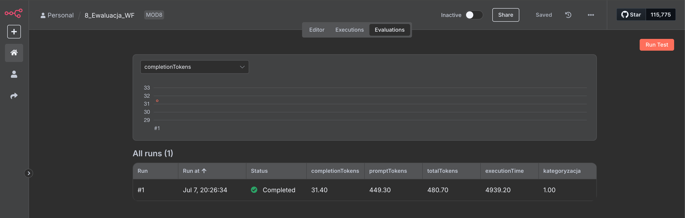

---
tags:
  - n8n
  - update
  - docker
---

# **N8N Evaluations – aktywacja w n8n**

Aby uzyskać dostęp do zaawansowanych funkcji w n8n, takich jak ewaluacja workflowów (testowanie przepływów na wielu danych wejściowych i mierzenie ich skuteczności), należy zarejestrować tzw. **Community Instance**. Proces ten jest bezpłatny i pozwala również korzystać z innych płatnych funkcji, takich jak historia workflowów, zaawansowane debugowanie czy organizacja workflowów w folderach.

Proces rejestracji jest jednorazowy i bezpłatny – po aktywacji zachowujesz dostęp do funkcji na stałe.

## Jak aktywować Community Instance i odblokować ewaluacje?
1. Po wejściu w sekcję **Evaluations** zobaczysz poniższy widok. Kliknij czerwony przycisk **Register Instance**.

2. W oknie **Enter email to receive your license key** wpisz adres e-mail, na który zarejestrowane jest Twoje konto w serwisie n8n.

3. Na podany adres e-mail otrzymasz wiadomość z kodem aktywacyjnym usługi **Community Instance**. Skopiuj ten kod i aktywuj usługę na swoim koncie lub kliknij bezpośrednio w czerwony przycisk **Activate License Key**. Zostaniesz przekierowany na stone N8N i proces aktywacji powinien dokonać się automatycznie.

4. Po aktywacji funkcjonalność **ewaluacji** powinna być już dostępna na Twoim koncie n8n.
