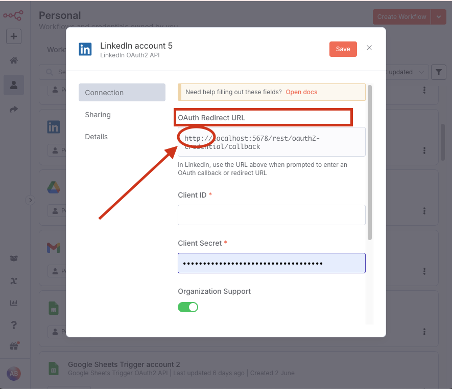

# Problem: Błędny `Redirect URL` dla LinkedIn w n8n

## Diagnoza

Gdy tworzysz poświadczenia dla LinkedIn, n8n generuje `Redirect URL` z `http://`. LinkedIn wymaga `https://` i odrzuca połączenie.

**Przyczyna:** Twój lokalny kontener n8n nie zna swojego publicznego adresu URL z `ngrok`.

## Rozwiązanie

Musisz poinformować n8n o jego publicznym adresie, ustawiając zmienną środowiskową `WEBHOOK_URL` w Dockerze.

### Instrukcja wideo

Poniższy film pokazuje, jak dodać zmienną `WEBHOOK_URL` podczas uruchamiania nowego kontenera n8n.

<iframe width="560" height="315" src="https://www.loom.com/embed/b0fb4aa94f90493da164214e88ee1c07" frameborder="0" webkitallowfullscreen mozallowfullscreen allowfullscreen></iframe>

