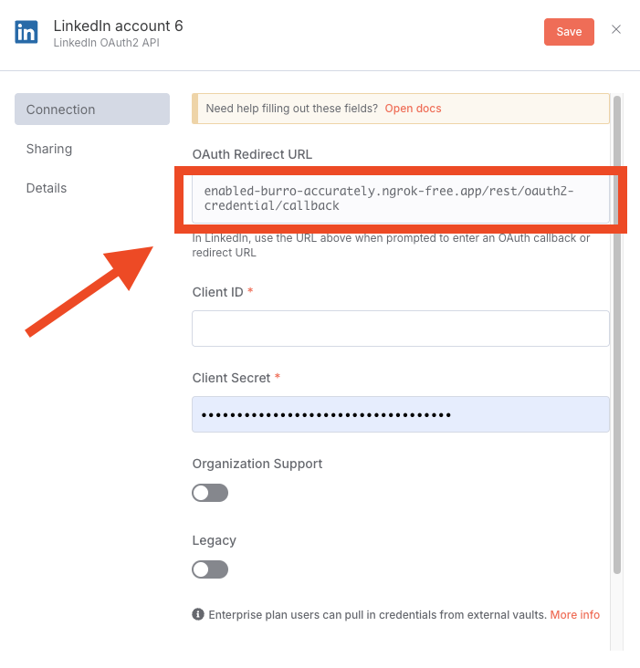
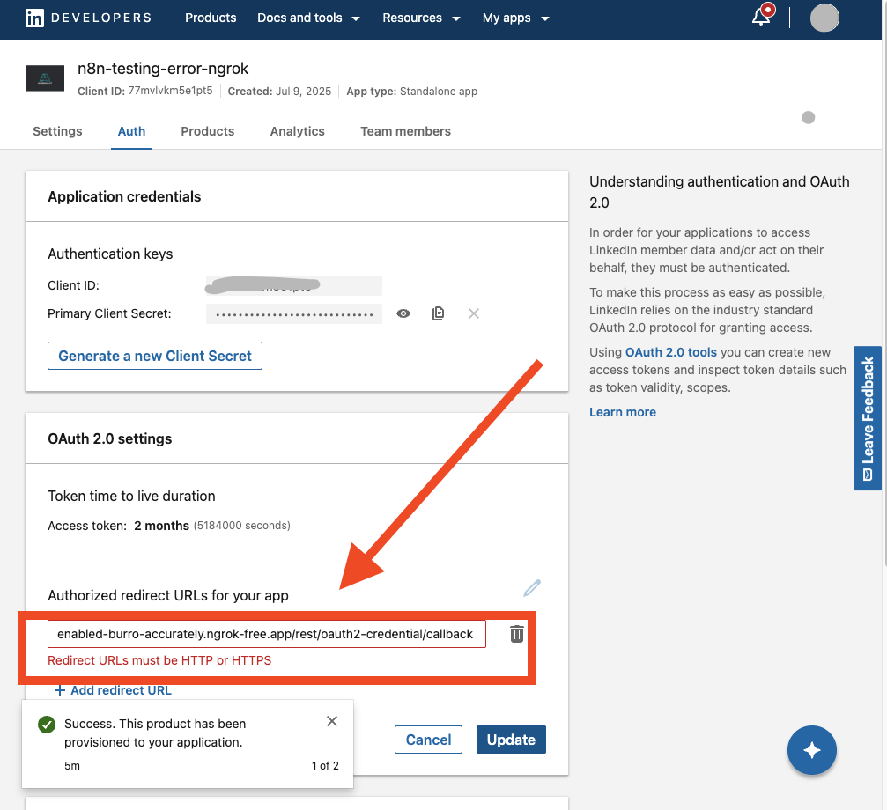
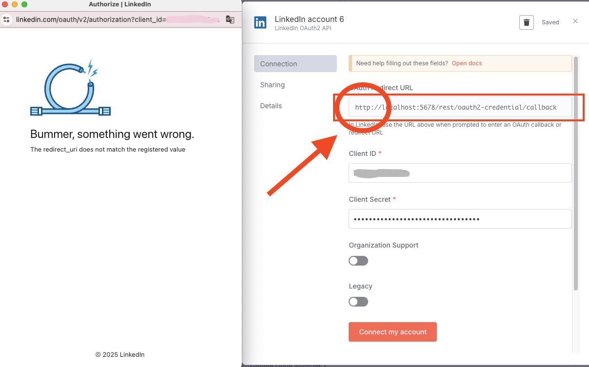
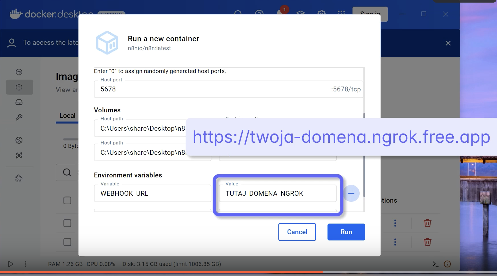

# Problemy z LinkedIn OAuth Redirect URL

Podczas pracy z n8n i LinkedIn, zwłaszcza przy użyciu `ngrok` oraz lokalnie, możesz napotkać różne scenariusze związane z `Redirect URL`. Poniżej znajdują się najczęstsze przypadki.

### 1. Praca lokalna z Docker i localhost

***Scenariusz:*** Uruchamiasz n8n lokalnie w kontenerze Docker i próbujesz stworzyć nowe poświadczenia do LinkedIn.

***Kroki i rezultat:*** W takim przypadku n8n wygeneruje URL zwrotny z `http://localhost:5678/...`. Po wklejeniu tego adresu do ustawień aplikacji na LinkedIn, poświadczenie tworzy się poprawnie, bez żadnego błędu. Jest to prawidłowe i oczekiwane zachowanie, ponieważ LinkedIn akceptuje `http://localhost` jako adres zwrotny dla celów deweloperskich.

### 2. Niekompletny Redirect URL w n8n (z ngrok)

***Diagnoza:*** W oknie tworzenia poświadczeń n8n, w polu `Redirect URL` brakuje protokołu `https://` na początku adresu.

***Przyczyna:*** Gdy n8n działa pod adresem z `ngrok`, ale nie ma ustawionej zmiennej `WEBHOOK_URL`, w oknie tworzenia poświadczeń wyświetla `Redirect URL` bez protokołu `https://` na początku, tak jak tutaj:

Jeśli skopiujesz i wkleisz taki niekompletny adres do ustawień aplikacji LinkedIn, zobaczysz błąd walidacji:

***Rozwiązanie:*** Utworzyć kontener n8n z `WEBHOOK_URL` ustawionym na adres `ngrok`.

### 3. Błąd "The redirect_uri does not match the registered value" (z ngrok)

***Diagnoza:*** Ten błąd pojawia się na stronie LinkedIn **po** tym, jak klikniesz przycisk logowania w n8n.

***Przyczyna:*** Ten błąd oznacza, że adres `Redirect URL` w Twojej aplikacji na LinkedIn jest poprawny (`https://...`), ale Twój kontener n8n nie wie, że działa pod publicznym adresem `ngrok`. Dzieje się tak, gdy kontener n8n został uruchomiony **bez** zmiennej środowiskowej `WEBHOOK_URL`. W efekcie n8n domyślnie informuje LinkedIn, że oczekuje przekierowania na `http://localhost`, co prowadzi do konfliktu adresów.

***Rozwiązanie:*** Uruchom ponownie kontener n8n, upewniając się, że zmienna środowiskowa `WEBHOOK_URL` jest ustawiona na Twój publiczny adres `ngrok` (np. `https://twoj-adres.ngrok-free.app`).

### Instrukcja wideo roziązania problemu WEBHOOK_URL

<iframe width="560" height="315" src="https://www.loom.com/embed/b0fb4aa94f90493da164214e88ee1c07" frameborder="0" webkitallowfullscreen mozallowfullscreen allowfullscreen></iframe>

