---
tags:
  - mcp
  - mcp-server
  - mcp gmail
  - composio
---

# **Pytania i problemy związane z MCP**

## **Tworzenie serwera MCP w Composio na przykładzie Gmail**

1. Wejdź na stronę [https://mcp.composio.dev/](https://mcp.composio.dev/) i zaloguj się.
    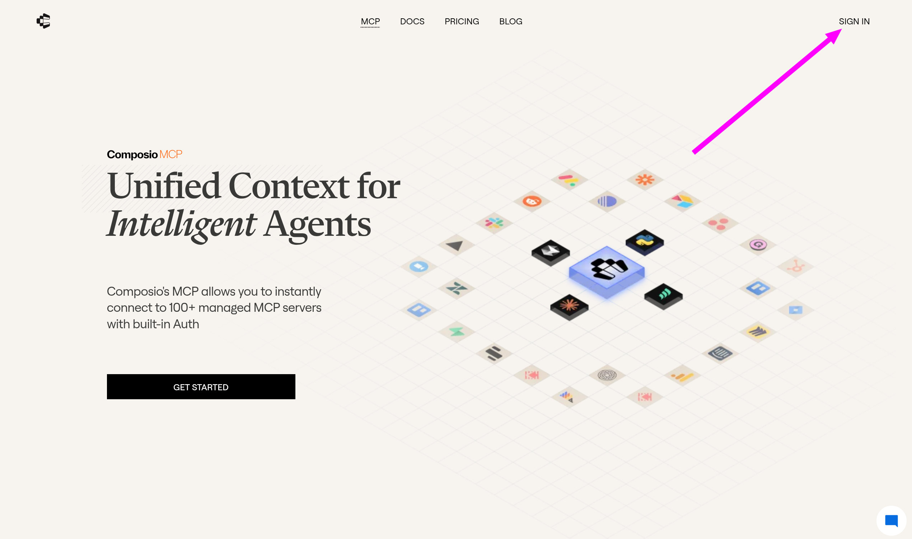

1. Następnie wyszukaj serwer Gmail i kliknij **Create Server**.
    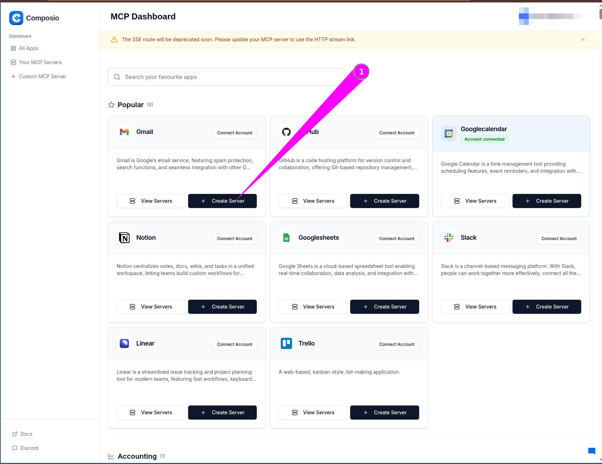

1. W kolejnym kroku wybierz nazwę dla swojego serwera (lub zostaw domyślną) i kliknij **Next**.
    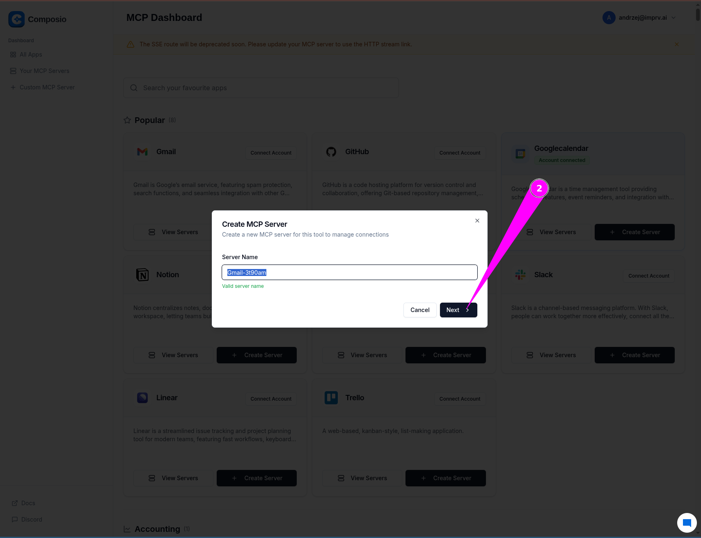

1. Upewnij się, że wybrana metoda autentykacji to **OAuth 2.0** i kliknij **Connect & Continue**.
    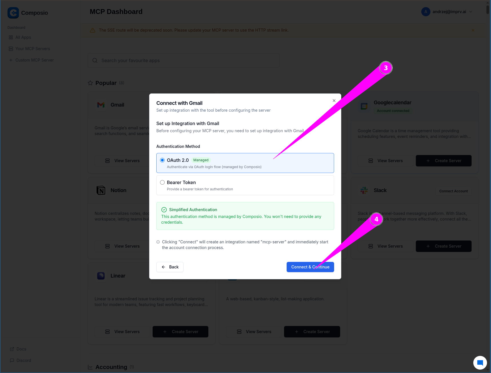

1. Następnie wybierz konto **Gmail**, które chcesz podłączyć do serwera.
    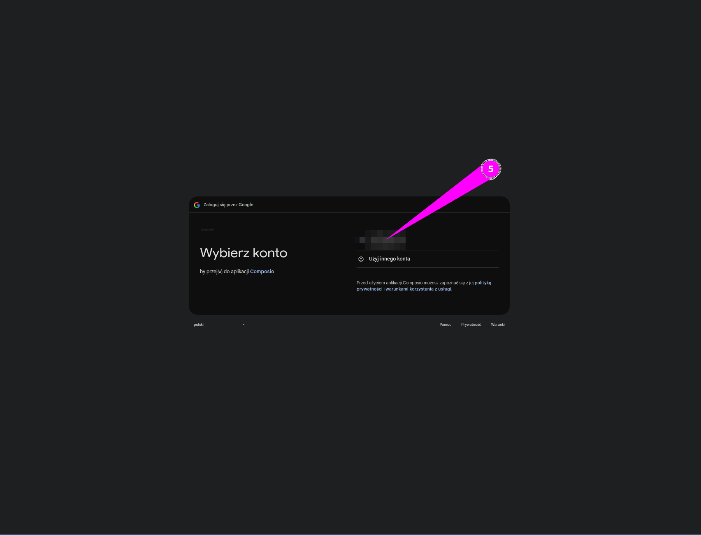

1. W tym kroku potwierdź, klikając **Continue**.
    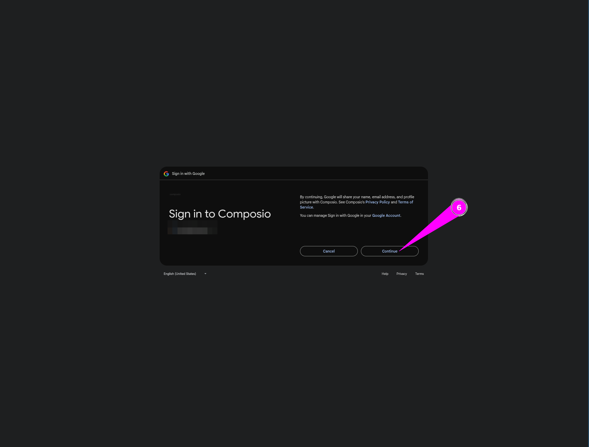

1. Teraz kliknij **Select All** na górze strony, aby zezwolić na dostęp. Po kliknięciu ptaszek powinien być zaznaczony. Następnie kliknij **Continue**.
    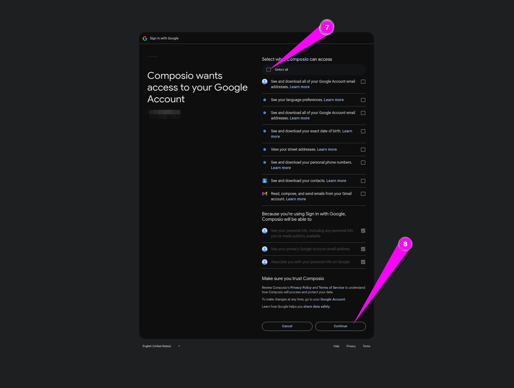

1. Po wykonaniu poprzedniego kroku zobaczysz ekran potwierdzający pozytywne połączenie z kontem Gmail. Możesz zamknąć tę kartę przeglądarki i wrócić do strony Composio.
    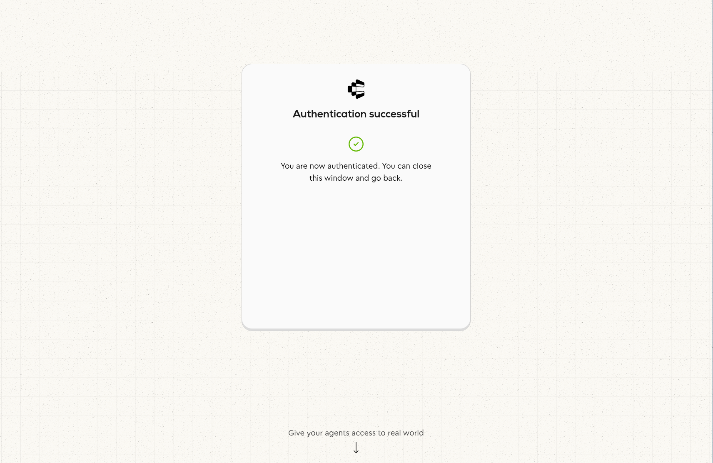

1. Tutaj możesz zobaczyć opcjonalny krok mówiący **Waiting for authorization...**. Poprzedni krok pokazał, że połączenie zostało ustanowione. Dlatego w tym kroku możesz teraz kliknąć **Back**.
    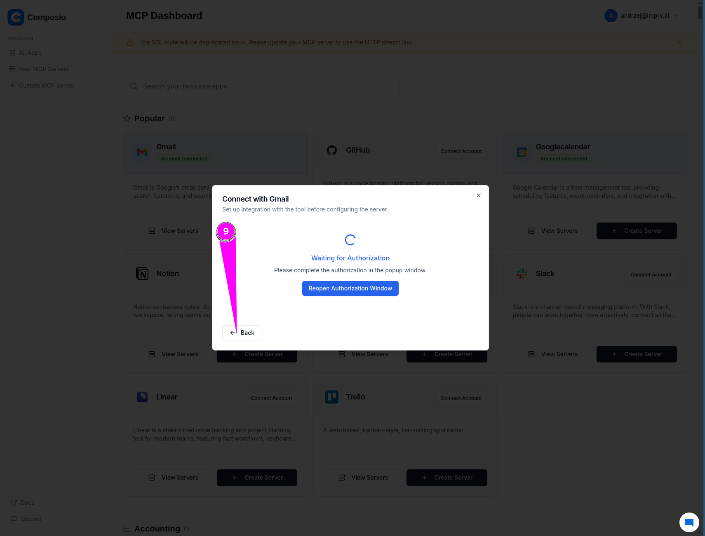

1. Zostaniemy przekierowani do strony tworzenia serwera. Jeśli teraz klikniemy **Next** to zobaczymy kolejny ekran, gdzie możemy ustawić uprawnienia serwera.
    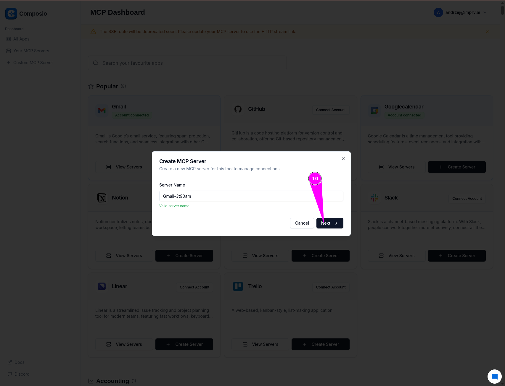

1. W tym kroku możemy ustawić uprawnienia serwera. Domyślnie zaznaczone są tylko ważne opcje (Important), ale możemy zaznaczyć również **OpenWorldHint**. Następnie kliknij **Create Server**, aby utworzyć serwer.
    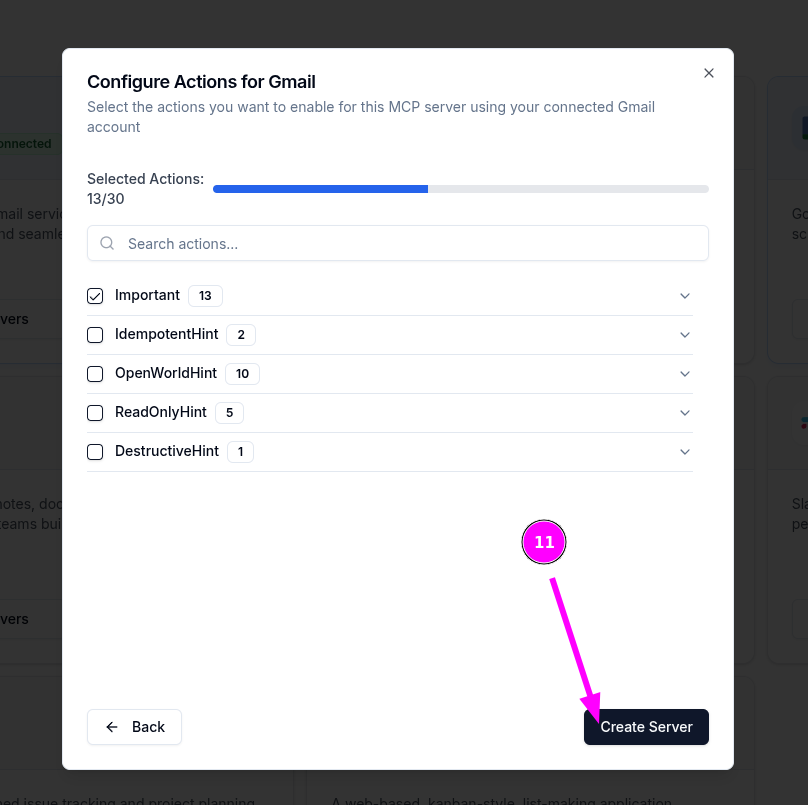

1. Po potwierdzeniu utworzenia serwera zostaniemy przekierowani do strony serwera, gdzie wyświetlają się dane połączenia z serwerem. W tym kroku należy przejść do sekcji **HTTP Stream** i skopiować adres URL.
    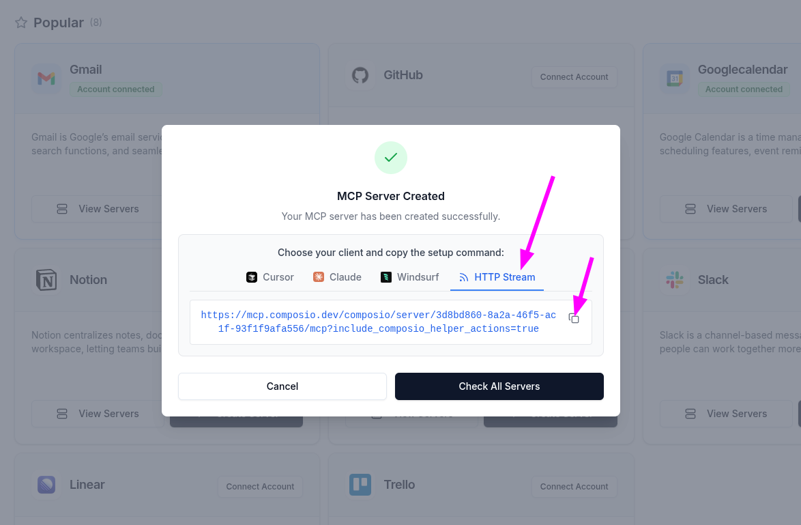

1. Skopiowany adres URL wklejamy do **Credentials Node'a MCP Client** w n8n.
    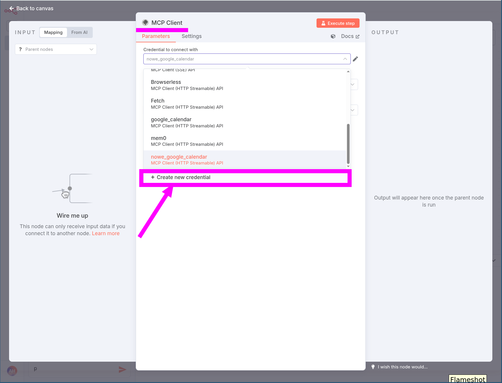
    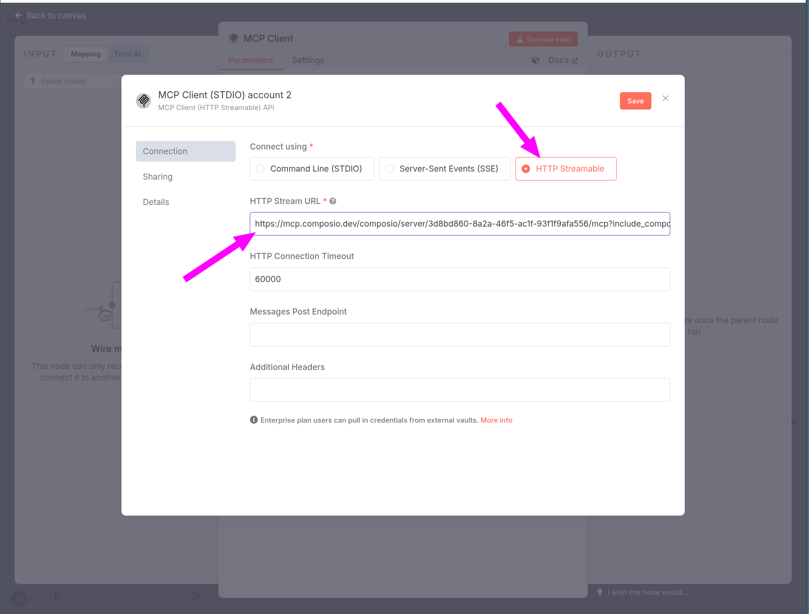
